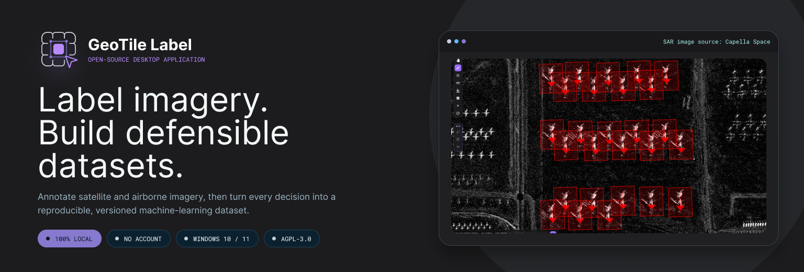
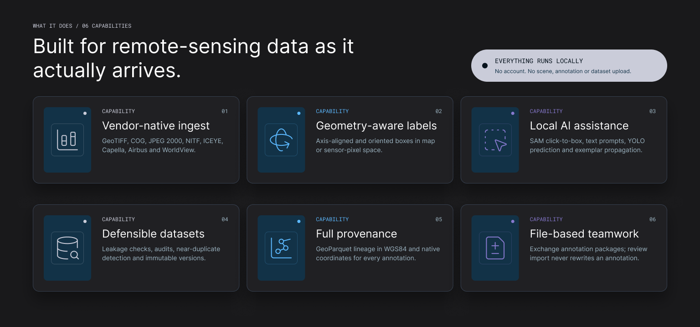
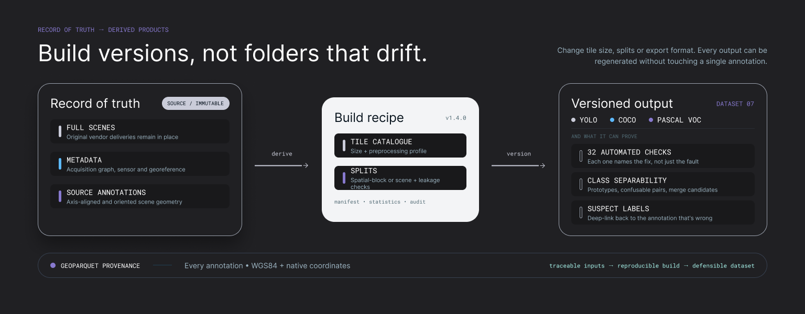
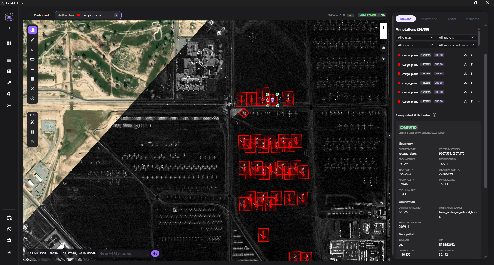
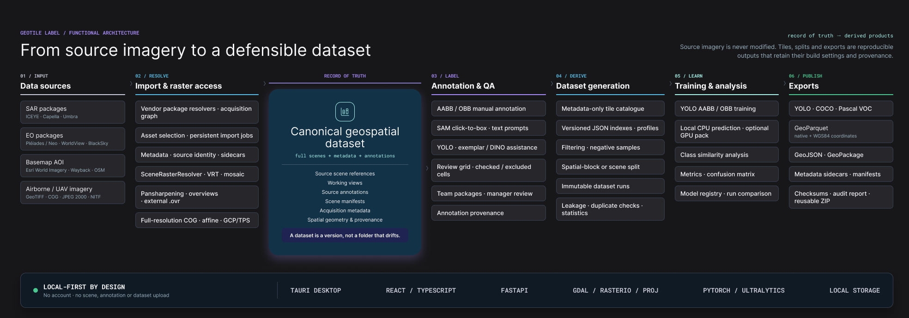

<div align="center">



[](../../releases)
[](#architecture)

</div>

GeoTile Label is a Windows desktop application for labeling remote-sensing imagery and
turning it into reproducible datasets for object detection. It handles electro-optical and
synthetic-aperture-radar scenes, georeferenced and non-georeferenced products, axis-aligned
and oriented bounding boxes. Everything that touches your data runs locally: the imagery, the
model runtime and the documentation are installed on the machine, there is no account, and no
scene, annotation or dataset is ever uploaded anywhere. The one component that does reach the
network is the optional reference map layer under georeferenced scenes, which fetches tiles
from Esri or OpenStreetMap; it is a display aid, and nothing it shows enters a dataset.

## What it does

<div align="center">

</div>

- **Reads vendor deliveries as they arrive.** GeoTIFF, COG, JPEG 2000, NITF and vendor
  packages from ICEYE, Capella, Airbus (Pléiades / Pléiades Neo) and WorldView. A delivery is
  resolved as an acquisition graph, not as "one folder, one scene", so multi-part products,
  several polarizations and sidecar metadata survive the import.
- **Labels in the geometry the data actually has.** Georeferenced scenes on a map with a
  reference basemap underneath, sensor-geometry scenes in pixel space. Oriented boxes are
  carried as scene-pixel polygons, so they stay correct on non-conformal projections.
- **Assists rather than replaces.** SAM click-to-box and text prompts, YOLO prediction,
  and "label one, find the rest" exemplar propagation - all running locally on CPU, with GPU
  used only if the optional training pack is installed.
- **Builds datasets you can defend.** Tile catalog, spatial-block or scene splits with
  leakage checks, dataset audit, near-duplicate detection, and GeoParquet provenance for every
  annotation in both WGS84 and native coordinates.
- **Trains and compares.** YOLO training runs with the GPU pack, a model registry, and
  side-by-side comparison of runs against the same held-out data.
- **Works in a team without a server.** Annotation packages are exchanged as files; review
  import never rewrites an annotation.

## The idea it is built on

<div align="center">

</div>

Source imagery is never modified, moved or copied into the project. Tiles, splits and
exports are derived products: they carry the settings they were built with, and they can be
regenerated with different ones without touching a single annotation. A dataset in GeoTile
Label is a version, not a folder that drifts.

## Installation

Download the installer from [Releases](../../releases) and run it.

Windows 10 or 11, x64. The installer is not code-signed, so SmartScreen shows a warning:
choose **More info → Run anyway** if the file came from a source you trust.

You do **not** need Python, Node.js, Rust or Docker. The installer carries the application,
a packed FastAPI backend with rasterio/GDAL, and CPU-only YOLO inference. The first launch
takes longer because the backend runtime is unpacked.

Model training additionally needs an NVIDIA GPU and the optional **GPU training pack**,
which is not part of the installer: neither NSIS nor WiX packs a payload of that size.
Labeling, the AI assistance tools and prediction all work without it.

The pack is not published as a release asset either - the CUDA runtime alone is about 3 GB.
Build it from this repository with `scripts/build-cuda-pack.ps1`; it lands in
`release/cuda-pack-<version>/` with checksums and an install README. Run
`scripts/fetch-base-models.ps1` first if you do not already have the base YOLO
weights - the repository carries the fetch script, not the weights. Build it from the same
revision as the installer you are using: the application refuses a pack from another version.

### Building from source

```powershell
# 1. The packed backend runtime FIRST - nothing else builds without it.
powershell -ExecutionPolicy Bypass -File .\scripts\build-backend-env.ps1

# 2. Optional: the DINO backbone code, if you want Dataset analysis in the installer.
#    Not in this repository - you fetch it, and accept its licenses, yourself.
powershell -ExecutionPolicy Bypass -File .\scripts\fetch-dino-repos.ps1

# 3. Frontend dependencies.
cd frontend
npm ci

# 4. Desktop build (installer lands in frontend\src-tauri\target\release\bundle\nsis).
npm run desktop:build
```

Step 2 is optional and deliberately not automatic. Without it the build prints a warning
and produces an installer in which **Dataset analysis does not work at all** - the
application never downloads model code by itself, which is what keeps it offline. The
script fetches both backbones; see [License](#license) before shipping the DINOv3 one.

Step 1 is not optional and not obvious: `tauri.conf.json` declares the runtime archive as a
bundled resource, and a resource glob that matches nothing aborts the Tauri build script with
exit code 101 *before* anything is compiled - so the error does not look like a missing file.
`scripts/build-release-desktop.ps1` performs the step itself; only manual `cargo` and `tauri`
invocations need it spelled out.

That step resolves the newest compatible dependency versions rather than installing a pinned
set, so it records what it actually installed in [`runtime-lock.txt`](runtime-lock.txt) -
conda packages with their full URLs, pip packages with their versions. **That file, not
`environment.yml`, is what tells you exactly what a released installer contains**;
`environment.yml` describes the development environment and does not drive this build.

## Quick start

1. **Create a project.** Point it at a folder of vendor deliveries and pick the imagery
   modality; a class list can be imported from JSON at any time.
2. **Import scenes.** The resolver reports what it recognized, what needs a decision and what
   it refused - nothing is imported on a guess.
3. **Label.** Draw axis-aligned or oriented boxes, or let SAM turn one click into a box.
   Annotations save themselves.
4. **Review by grid.** Mark grid cells as checked or excluded, so "no annotation here" and
   "nobody looked here" stop being the same thing.
5. **Build a dataset.** Choose tile size, split strategy and preprocessing profile; the run is
   immutable and carries its own manifest, statistics and audit.
6. **Export or train.** YOLO, COCO and Pascal VOC, or a training run against the version you
   just built.

<div align="center">

<br><sub>Step 3 - the labeling view on a georeferenced scene, with the annotation list beside the map.</sub>
</div>

## AI labeling tools

Three assistants take the drawing off your hands, and every one of them runs on your own
machine: no account, no upload, no network call. They work on the CPU in every
installation; the GPU pack is for training your own models, not for these.

Each still below links to the recording it was taken from. The same clips play inline in
the [documentation](https://jakubslesinski.github.io/geotile-label/en/ai-assistance/index.html).

### Click to box

Click an object, get a box. SAM proposes the **shape**, you assign the class. On dense
satellite scenes it deliberately selects the mask of a **single object** instead of the
largest blob, and an already selected annotation of the same class becomes a size hint for
the clicks that follow. In oriented-box projects the front direction arrives as something
to confirm, not as a silent guess. SAM1, SAM2, SAM3 and FastSAM weights are all supported.

<video src="https://github.com/user-attachments/assets/17e5fb21-684b-4b0c-acc6-6d7c481a27b1" poster="https://raw.githubusercontent.com/jakubslesinski/geotile-label/main/docs/assets/images/sam-click-to-box-poster.jpg" controls muted playsinline width="820"></video>
<br><sub>One click turns into the outline of a single object.</sub>

### Text prompt (SAM3)

Type a phrase, choose the current view or draw a rectangle over part of it, and SAM3
segments every instance it finds. Each one arrives as a proposal carrying its own
confidence, to accept or reject one by one or in bulk. The vocabulary is open and English:
`military vehicle` or `ship` is a good prompt, a class code such as
`pojazd_transportowy_kategoria_iii` is a poor one. Requires a SAM3 checkpoint and its text
encoder.

<video src="https://github.com/user-attachments/assets/8c1df2c6-8808-4b7a-9df5-b13bfea487c3" poster="https://raw.githubusercontent.com/jakubslesinski/geotile-label/main/docs/assets/images/sam3-text-prompt-poster.jpg" controls muted playsinline width="820"></video>
<br><sub>One phrase, every instance in the view.</sub>

### Find similar

Mark one annotation as the exemplar and the rest of its kind is found across the scene.
Two engines answer that question differently: **Template** correlates pixels and edges,
offline on the CPU and quick on electro-optical imagery; **DINO** compares learned
features, which makes it few-shot with no training at all, robust to changes of scale,
rotation and illumination, and the one that also works on **SAR**. Several exemplars can
be selected at once, and DINO averages them into a single prototype.

<video src="https://github.com/user-attachments/assets/2dd3981d-6b5d-47ba-8187-4d4651ad4780" poster="https://raw.githubusercontent.com/jakubslesinski/geotile-label/main/docs/assets/images/find-similar-poster.jpg" controls muted playsinline width="820"></video>
<br><sub>One selected object, the rest found automatically, here on SAR.</sub>

## Documentation

**Read it in a browser:
[jakubslesinski.github.io/geotile-label/en/](https://jakubslesinski.github.io/geotile-label/en/index.html)**

The same documentation ships inside the application: press **F1** or the **Documentation** button. It
works offline and does not need the backend running. Help opens in the interface language,
which defaults to English; Polish can be selected in **Settings**.

The documentation is bilingual and complete in both languages: all 60 pages have a full
English version, and section and page navigation is English throughout.

The sources live in [`docs/`](docs) and build with `scripts/build-docs.ps1`.

## Architecture

<div align="center">

</div>

An interactive overview - the processing pipeline from source imagery to export, and the data
model with its entities and relations - is in [`docs/architecture/`](docs/architecture). It is
generated from [`architecture-model.json`](docs/architecture/architecture-model.json), which is
the single source for both the diagrams and the explorer; the `.d2` files are generated
artifacts and are not edited by hand.

The engineering decisions that code comments cite by stage id are collected in
[`DESIGN_DECISIONS.md`](DESIGN_DECISIONS.md), including the ones that record what the software
deliberately does *not* do.

## If the application does not start

This section stays in the README on purpose: it covers the one situation in which **F1** and
the built-in help are unavailable.

The start screen offers **Restart backend**, **Open logs folder** and **Export diagnostics ZIP**.
The logs live in `%APPDATA%\GeoTileLabel\logs`:

- `app.log`
- `backend.stdout.log`
- `backend.stderr.log`
- `conda-unpack` logs from unpacking the backend runtime

If the problem repeats, send the ZIP produced by **Export diagnostics ZIP** to
[jakub.slesinski@wat.edu.pl](mailto:jakub.slesinski@wat.edu.pl). It contains schema versions,
scene identity state, a sanitized last import report and cache statistics. It does **not**
contain source scenes, annotations or full geometries.

Everything else - a scene that will not open, prediction reported as unavailable, a package
import that fails - is covered by the **Troubleshooting** section of the documentation.

## Development

**[Development guide](https://jakubslesinski.github.io/geotile-label/en/development.html)**
- requirements, running the backend and frontend, the checks, the architecture drift gate
and the release build. It is part of the documentation site and ships in the offline help.

[`README_dev.md`](README_dev.md) is the exhaustive reference behind it, down to resolver
internals and per-vendor product rules; it is in Polish.

## License

GeoTile Label is released under the **GNU Affero General Public License v3.0** - see
[`LICENSE`](LICENSE).

The choice is not incidental. Training, prediction, YOLO export and the model registry are
built on `ultralytics`, which is AGPL-3.0 and is imported directly rather than kept behind a
process boundary. Releasing the application under a permissive license would have meant taking
those capabilities out of it. Third-party components and their licenses are inventoried in
[`THIRD_PARTY_NOTICES.md`](THIRD_PARTY_NOTICES.md), regenerated by
`scripts/generate-third-party-notices.py`.

Be aware that AGPL-3.0 obligations extend to derived works.

### One bundled component is not under an open-source license

**Dataset analysis** uses the DINO backbone architecture, and the installer bundles the code
of both `facebookresearch/dinov2` (Apache-2.0) and `facebookresearch/dinov3` so the feature
works offline. The model weights are not shipped; you supply them.

`dinov3` is covered by the **DINOv3 License**, which is not OSI-approved. It permits
royalty-free redistribution, but it travels with the code and binds every recipient, and it
prohibits use for **military or warfare purposes, espionage, nuclear applications and
activities subject to ITAR**. The full text is installed alongside the code, and the
obligation is set out at the top of
[`THIRD_PARTY_NOTICES.md`](THIRD_PARTY_NOTICES.md).

So the AGPL-3.0 statement above describes the application and every other bundled component,
but not that one. If those terms do not suit your deployment, remove
`data/models/dino/dinov3_repo` before building: the build bundles whichever repositories are
present, and an installer without it keeps Dataset analysis working on DINOv2, losing only
the DINOv3-SAT variant.

## Citing

If you use GeoTile Label in your research, please cite it. GitHub renders the metadata from
[`CITATION.cff`](CITATION.cff) under **Cite this repository**.

## Contact

- Jakub Ślesiński - [jakub.slesinski@wat.edu.pl](mailto:jakub.slesinski@wat.edu.pl)
- Department of Imagery Intelligence, Faculty of Civil Engineering and Geodesy,
- Military University of Technology
