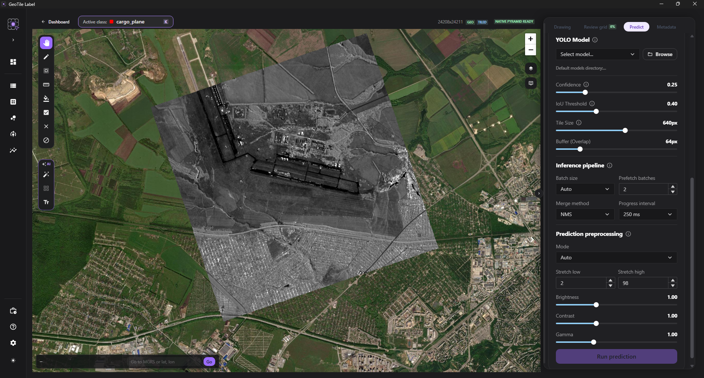

# YOLO prediction

**Goal.** Pre-label the objects on a scene with a model, to cut down on drawing from
scratch.

**When.** When you have a model trained on similar material.

**Requirements.** A `.pt` model available on disk. Prediction runs on the CPU and is part
of every installation - it does not need the GPU pack.

## Steps

1. In the prediction panel choose **Select model** and point to the `.pt` file.
2. Set the **Confidence** and **IoU** thresholds.
3. Choose **Run prediction**.
4. Wait for the result - a long run can be stopped with the **Cancel prediction** button.

Whole-scene inference is a durable `scene_inference` job. Its progress stays visible under
[Background jobs](../reference/zadania-w-tle.md), including after you move to another
view.

*The prediction configuration before starting.*

## Checkpoint

Proposals appear on the scene, and the counter of pending results shows how many.

!!! danger "A proposal is not an annotation yet"

    Prediction results are **temporary**. They do not enter the canonical annotations, will
    not reach a dataset and will not be handed over in a package until you accept them. That
    is deliberate: the model suggests, a person decides.

## Reviewing proposals

Every proposal can be accepted, corrected before acceptance, or removed. Select several
proposals at once (++ctrl++ - one by one, ++shift++ - a range) and act in bulk: **Accept
all** or **Delete selected**. Removing a proposal and rejecting it are the same thing -
the proposal disappears from the list and does not reach the annotations.

!!! warning "“Accept all” after looking, not instead of looking"

    Bulk acceptance is convenient when the model is proven on this material and you have
    been through the result. Used blind, it introduces mistakes into the dataset that nobody
    will catch afterwards - and a model trained on them will reproduce them in the next
    cycle.

## Thresholds

The **Confidence** threshold decides from what certainty the model reports an object. A
lower one gives more proposals, including more false ones; a higher one skips uncertain
objects.

The **IoU** threshold governs duplicate removal - overlapping detections of the same
object.

!!! tip "Start with a threshold that gives slightly too much"

    Removing a superfluous proposal takes a second. Finding an object the model did not
    report means going through the whole scene - which is exactly what prediction was
    supposed to save.

## Class matching

The classes of the model are matched to the classes of the project **by name**.

!!! warning "The name has to match"

    A model class with no counterpart in the project will not be matched. If the results
    land in the wrong class or do not appear at all, compare the model class names with the
    [project classes](../projects/klasy.md).

## Preprocessing

Prediction preprocessing is **independent of the display settings**. Changing the
brightness or the contrast on screen does not affect what the model sees.

!!! info "Large scenes are analyzed in tiles"

    Prediction divides a scene into fragments and assembles the results. That is why it
    works on imagery that would not fit into memory as a whole.

## Whole-scene performance

| Setting | Meaning |
| --- | --- |
| **Batch** | `auto` picks a conservative number of windows from the free VRAM; 1–64 can also be given |
| **Prefetch batches** | the number of prepared batches in the bounded queue, 1–8 |
| **Merge method** | currently class-aware NMS for the results of overlapping tiles |
| **Progress interval** | how often the worker persists the progress of a long run |

On a CPU, `auto` chooses a batch of 1. After a CUDA OOM error an automatic batch is split
and retried; a batch chosen explicitly is not changed without the user knowing. The memory
of the queue is bounded by `batch × prefetch`, so increasing both parameters at once
increases RAM and VRAM use.

Cancellation is checked between batches and before the results are merged. A partial
result does not become a set of proposals to accept.

## Common problems

**Prediction is unavailable.** See
[Prediction is unavailable](../troubleshooting/predykcja-niedostepna.md).

**The model detects nothing.** Check the confidence threshold and whether the model was
trained on a similar modality - a model from optical material will not work on SAR.

**The results are shifted relative to the objects.** Check whether the scene has the
**source changed** status.

## Related

- [AI tools](index.md) - SAM and exemplar matching
- [Model registry](../training/rejestr-modeli.md) - a model trained in the application
