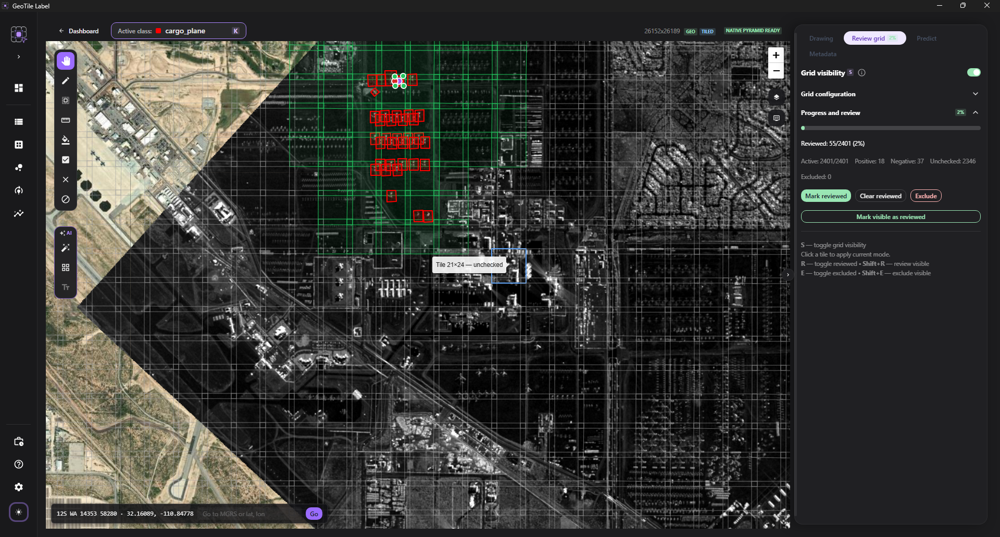

# Siatka przeglądu

**Cel.** Zapisać, które fragmenty sceny zostały świadomie obejrzane.

**Kiedy.** Przy pracy na dużych scenach, gdzie bez tego nie da się stwierdzić, co już
zrobiono.

## Po co to jest

Duża scena nie mieści się na ekranie i nie da się jej ogarnąć pamięcią. Siatka dzieli
ją na komórki i pozwala odnotować przejrzane fragmenty - **również te, w których nic
nie znalazłeś**.

!!! info "Sprawdzone i puste to nie to samo, co nieobejrzane"

    To najważniejsze rozróżnienie na tej stronie. Komórka bez adnotacji może znaczyć
    „sprawdziłem, nic tu nie ma" albo „jeszcze tu nie zaglądałem" - a to zupełnie inna
    informacja przy budowaniu datasetu. Puste fragmenty potwierdzone przez człowieka są
    wartościowym materiałem uczącym; nieobejrzane są ryzykiem.

!!! warning "Siatka nie tnie sceny na obrazy"

    Utworzenie siatki zapisuje **geometrię, powiązania z adnotacjami i stan
    przeglądu** - nie tworzy plików obrazów. Obrazy treningowe powstają dopiero przy
    budowaniu datasetu. Patrz [Katalog kafelków](../datasets/katalog-kafelkow.md).

## Utworzenie siatki

1. Otwórz scenę i przejdź do zakładki **Siatka przeglądu**.
2. Rozwiń **Konfigurację siatki**.
3. Ustaw **Rozmiar komórki siatki** i **Nakładanie siatki**.
4. Utwórz siatkę.

**Punkt kontrolny.** Panel przechodzi do sekcji **Postęp i przegląd**, a na mapie
pojawia się siatka.

*Panel siatki przeglądu po utworzeniu.*

!!! info "Rozmiar komórki = rozmiar kafla datasetu"

    Siatka przeglądu i dataset korzystają z **tego samego katalogu kafli**, więc **rozmiar
    komórki i nakładanie ustawione tutaj to dokładnie parametry kafli treningowych**. Zakładka
    Budowanie datasetu tylko je dziedziczy (pokazuje do wglądu). Wartości początkowe wybierasz
    już przy [tworzeniu projektu](../projects/utworz-projekt.md).

!!! warning "Zmiana rozmiaru po rozpoczęciu przeglądu zeruje postęp"

    Ponieważ tożsamość kafla zależy od jego rozmiaru, zmiana rozmiaru/nakładania **przebudowuje
    siatkę i kasuje stan przeglądu** (sprawdzone / wykluczone / puste komórki). Gdy jest co
    stracić, przycisk przebudowy wymaga **świadomego potwierdzenia** (checkbox). Jeśli potrzebujesz
    innej skali obiektu bez ruszania przeglądu, użyj Wspólnego GSD przy budowie datasetu.

## Oznaczanie komórek

Trzy tryby przełączane przyciskami:

| Tryb | Co robi |
| --- | --- |
| **Oznacz sprawdzone** | zapisuje, że fragment został obejrzany |
| **Wyczyść sprawdzenie** | cofa oznaczenie |
| **Wyklucz** | wyłącza fragment z dalszego użycia |

Klikaj pojedyncze komórki albo **przeciągnij** kursorem, żeby oznaczyć ciąg naraz.

Działają też skróty - bez przełączania trybu:

| Skrót | Działanie |
| --- | --- |
| ++r++ | oznacz komórkę pod kursorem |
| ++shift+r++ | oznacz wszystkie widoczne |
| ++e++ | wyklucz komórkę pod kursorem |
| ++shift+e++ | wyklucz wszystkie widoczne |
| ++s++ | pokaż lub ukryj siatkę |

!!! tip "Widoczne, czyli w bieżącym kadrze"

    ++shift+r++ i ++shift+e++ działają na komórkach widocznych na ekranie. Przybliż
    obszar, który chcesz objąć, zanim ich użyjesz - inaczej łatwo oznaczyć więcej,
    niż zamierzasz.

## Kiedy wykluczać

Wykluczenie mówi „ten fragment nie ma trafić do datasetu". Typowe powody:

- zachmurzenie albo inne zakłócenie uniemożliwiające ocenę;
- obszar bez danych - ramka nodata przy produktach geokodowanych;
- teren poza zakresem zadania.

!!! info "Wykluczenie to nie to samo co pominięcie"

    Komórka wykluczona jest **świadomą decyzją**, zapisaną i widoczną w audycie.
    Komórka nieobejrzana to brak decyzji. Audyt datasetu traktuje je inaczej.

## Liczniki

| Licznik | Znaczenie |
| --- | --- |
| **Sprawdzone** | komórki oznaczone jako obejrzane |
| **Aktywne** | komórki brane pod uwagę, czyli bez wykluczonych |
| **Z adnotacjami** | komórki zawierające obiekty |
| **Puste** | komórki sprawdzone, w których nic nie ma |
| **Niesprawdzone** | pozostałe do obejrzenia |
| **Wykluczone** | wyłączone z użycia |

Procent postępu na zakładce liczy się względem komórek **aktywnych** - wykluczenie
fragmentu nie zaniża wyniku.

## Produkty z szeroką ramką nodata

Niektóre produkty geokodowane mają dużą pustą ramkę, bo obszar akwizycji jest obrócony
względem układu współrzędnych. Siatka pokrywa **cały raster**, więc część komórek
wypada nad pustym obszarem.

!!! tip "Wyklucz pustą ramkę hurtem"

    Zamiast przeglądać puste komórki pojedynczo, przybliż obszar ramki i użyj
    ++shift+e++. Zostawienie ich jako niesprawdzonych zaniża postęp i utrudnia ocenę,
    czy scena jest gotowa.

## Powiązane

- [Katalog kafelków](../datasets/katalog-kafelkow.md) - co powstaje z siatki
- [Audyt datasetu](../datasets/audyt.md) - jak niesprawdzone obszary wpływają na ocenę
- [Skróty klawiaturowe](../reference/skroty.md)
