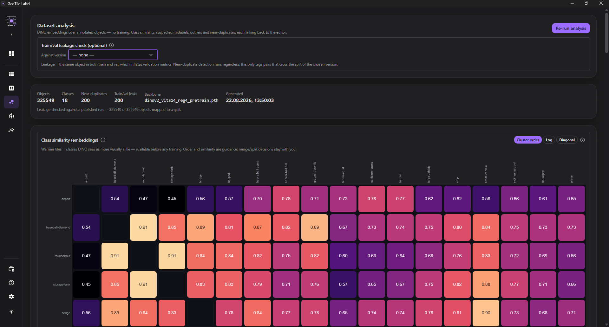
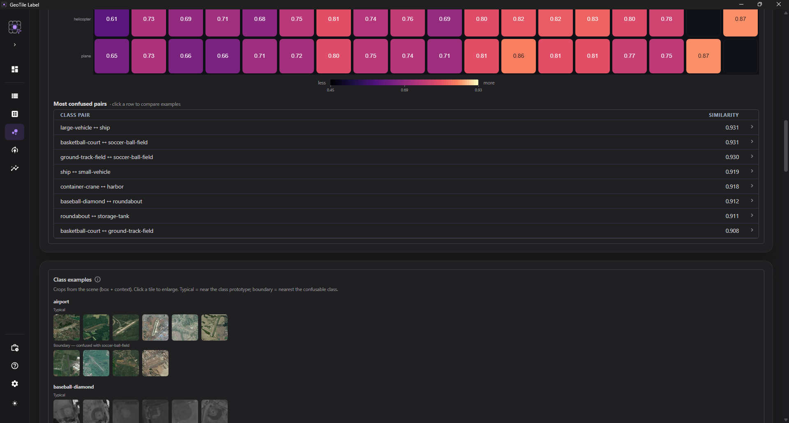

# Dataset analysis

**Goal.** See the **structure of the set before training starts** - which classes are
visually similar to one another, which objects look mislabeled, where the duplicates are,
and whether there is leakage between the training and the validation set. Without
training a model.

**Where.** A separate **Dataset analysis** entry in the sidebar, between *Dataset* and
*Training*. It is computed on **the labeled objects of the project** (the cropped boxes),
not on finished tiles.

*Class similarity, suspicious labels and near-duplicates - all of it linked back to the editor.*

## How it works

Every labeled object is turned into a **feature vector** by a frozen **DINO** backbone (a
foundation model, without fine-tuning). Similarities are computed on those vectors. That
gives a signal about **the quality of the set available immediately** - there is no need
to wait for a training result.

!!! info "DINO weights are required"

    The analysis needs DINO weights in the models directory (`models/dino`, for example
    `dinov2_vits14_reg4_pretrain.pth`). The model code ships with the application - you
    supply only the weights file. Without the weights the button reports a readable reason
    instead of quietly computing something meaningless. Everything runs **offline**. It is
    faster on a GPU, but a CPU is enough.

!!! warning "The DINOv3 code is not under an open-source license"

    Two backbone repositories are bundled: `dinov2` (Apache-2.0) and `dinov3`. The latter is
    covered by the **DINOv3 License**, which permits redistribution but binds every recipient
    and prohibits use for **military or warfare purposes, espionage, nuclear applications and
    activities subject to ITAR**. The full text is installed next to the code. If those terms
    do not suit your deployment, the DINOv2 variants cover the same analysis, only without
    DINOv3-SAT.

The analysis runs **in the background** - a progress bar shows the stages (loading the
backbone → embeddings → similarity → duplicates → class examples). The result is stored,
so you come back to it without computing it again (**Recompute** refreshes it).

The `embedding_analysis` job is durable: you can leave the view, cancel it under
[Background jobs](../reference/zadania-w-tle.md) and resume from a safe checkpoint. The
result is tied to the annotation revision; changing the objects requires recomputation.

## Scaling to large projects

For smaller collections the similarity and near-duplicates are computed exactly. Above a
safe memory limit the application uses an approximate ANN index and a bounded `top-k`,
instead of building the full matrix of all pairs in RAM.

!!! info "What approximate search means"

    The nearest, most obvious duplicates remain the priority, but the order of less similar
    candidates may differ marginally from an exhaustive comparison. The backend and the
    limit applied are recorded with the analysis result, so that the run is auditable.

## What you get

### Class similarity

A heat matrix of class pairs - **a warmer tile = classes DINO sees as visually closer**.
It is the same widget as the confusion matrix from training, but the signal comes from the
embeddings, so it is available **before** training. The classes are arranged so that
confusable families sit next to each other. Below it is a list of the most similar pairs.

The tiles have **rounded corners**, and with few classes the similarity value is written
inside them. The palette is **stretched to the actual range** of the values (similarities
from embeddings lie close together, ~0.85–0.99), so that the differences between classes
are visible rather than blended into one color. The **legend** below the matrix gives the
bottom, middle and top of the scale numerically. Three switches govern readability:
**Cluster order** (the grouped versus the original layout), **Log** (a logarithmic scale),
**Diagonal** (the diagonal = a class's similarity to itself).

**Clicking a tile** off the diagonal - or a row in the list of similar pairs - **selects a
class pair** and opens the [example gallery](#class-examples) for it side by side; the
selected pair is highlighted in the matrix and in the list.

### Class examples

Below the matrix there is a **gallery of crops from the scene** (the object box plus some
context) - so that you can see **what** the similarity consists of, not only that it
exists. The crops are rendered once, together with the analysis, and stored, so they load
quickly.

For every class the examples are split into two **labeled groups**:

- **typical** - the objects closest to the "prototype" of the class, that is, what the
  class typically looks like;
- **boundary** - the objects closest to **the neighboring, confused class** (the caption
  says which); those are the ones that drive the confusions.

Clicking a tile opens an **enlarged preview**; the ← → arrows step through the crops, and
clicking outside the preview (or `Esc`) closes it.

When you select a class pair (by clicking in the matrix or in the pair list), the gallery
shows **both sets side by side** - a direct "A versus B" comparison on specific objects.
Without a pair selected you see strips for every class, in the same order as the matrix.

!!! info "The gallery requires a fresh analysis"

    The examples are produced during the embedding analysis. Results computed with an older
    version of the application do not have them - run **Recompute** to make the gallery
    appear.

*The pair list and the class examples below the matrix.*

### Class consistency

For every class: **the average similarity of its objects to their own "prototype"**. Low
consistency (or a wide spread) marks a visually heterogeneous class - a candidate for
splitting or for revising the definition.

### Suspicious labels

Objects **closer to the prototype of another class than to their own** - the typical
symptom of a labeling mistake. The queue is sorted by "confidence of the mistake" and
shows the suggested class. The **Fix** button opens the object in the editor.

### Outliers

Objects **far from the prototype of their own class**, but not closer to another one -
difficult cases or bad crops. Worth looking at, though not necessarily wrong.

### Near-duplicates and train/val leakage

Pairs of objects with **almost identical features**: redundant annotations or - once the
leakage check is turned on - **leakage between the sets**.

Near-duplicate detection works **always**. A separate, optional control above the panel -
**the train/val leakage check** - lets you point at a **published dataset version**; the
application then maps every object onto its set (training / validation / test) in that
version and marks pairs crossing train↔val as **leakage** (a red badge and a counter).
Without a version selected there is no split, so only redundancy is visible. If you do not
have a published version yet, the control will point out that it has to be
[published](publikowanie.md) first.

!!! warning "Train/val leakage is a silent killer of metrics"

    If the same (or almost the same) object lands in both the training and the validation
    set, the model "sees the answers" - the validation result is inflated. The **train/val
    leakage** counter and the set labels on the pairs show where that is happening. The fix:
    correct the annotations or change the split mode and **generate a new version** of the
    dataset.

### The 20 most similar

For any object (**Similar**) - a list of the 20 objects closest to it in the whole set,
each linked to the editor. A quick way to close a class off and catch divergences in the
labels.

## From a finding to a fix

Every list (labels, outliers, duplicates, similar) leads **with one click to the editor**
positioned on that object. That closes the *analyze → correct the annotation* loop.

!!! info "Recommendations, not decisions"

    The analysis **makes the structure of the set visible** - it does not merge classes or
    delete objects for you. The ordering, the similarities and the flags are a hint; the
    decision belongs to the analyst.

## When to look here

- **Before training** - to catch label mistakes and leakage before you invest in a training
  run.
- **After building a version** - to check leakage against one specific, published split.
- **In a dispute about taxonomy** - to see which classes really are visually
  indistinguishable.

## Related

- [Dataset contents](zawartosc.md) - tiles with boxes from a finished version
- [Audit](audyt.md) - the readiness of a version for training (spatial leakage, split
  integrity)
- [Publish a version](publikowanie.md) - the version needed for the leakage check
- [Compare results](../training/wyniki.md) - the confusion matrix, after training
