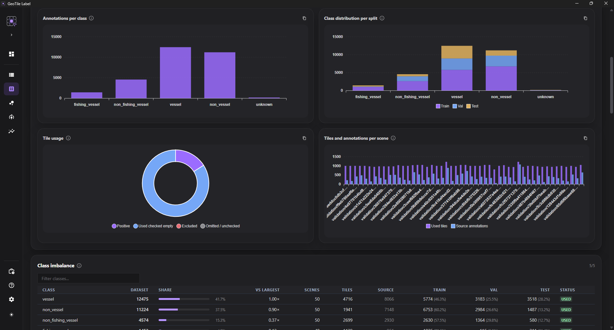

# Statystyki datasetu

Zakładka pokazuje, co faktycznie znalazło się w wersji datasetu. Służy do wychwycenia
problemów, których audyt nie zgłasza jako błąd, ale które psują trening.

## Co znajdziesz

- liczbę adnotacji źródłowych i adnotacji po propagacji do kafelków;
- rozkład klas i rozkład podziału na zbiory;
- kafelki z adnotacjami, użyte sprawdzone puste komórki, wykluczenia techniczne oraz
  komórki pominięte lub niesprawdzone;
- wykorzystanie poszczególnych scen;
- klasy nieużywane i sceny bez adnotacji.

!!! tip "Długie nazwy są skracane na osiach"

    Pełną nazwę klasy albo sceny zobaczysz po wskazaniu elementu kursorem.

*Statystyki wersji datasetu.*

## Adnotacje źródłowe a kafelkowe

Dwie różne liczby i **normalne jest, że się różnią**.

Adnotacja źródłowa leży na pełnej scenie. Przy cięciu może trafić do kilku kafelków -
zwłaszcza gdy kafelki nachodzą na siebie - więc liczba po propagacji bywa wyższa.

!!! warning "Duża różnica w drugą stronę to sygnał ostrzegawczy"

    Jeśli adnotacji kafelkowych jest **wyraźnie mniej** niż źródłowych, część obiektów
    wypadła z datasetu. Typowe przyczyny: filtry źródeł zawężone mocniej, niż
    zamierzano, albo obiekty leżące w komórkach niesprawdzonych bądź wykluczonych.

## Rozkład klas

Nierównowaga klas jest normalna w danych rzeczywistych, ale skrajna potrafi sprawić,
że model zignoruje klasy rzadkie.

Gdy jedna klasa dominuje, rozważ podział przestrzenny z równoważeniem klas albo
świadomą decyzję, że rzadkie klasy nie są jeszcze gotowe do treningu.

!!! info "Klasa z kilkoma przykładami to zwykle za mało"

    Lepiej wyłączyć ją filtrem i dotrenować później, niż uczyć model klasy, której
    praktycznie nie widział - inaczej będzie ją mylił z podobnymi.

## Wykorzystanie scen

Pokazuje, ile kafelków pochodzi z której sceny. Skrajna dominacja jednej sceny
oznacza, że model uczy się głównie jej warunków - pory dnia, kąta patrzenia,
charakterystyki sensora.

To szczególnie istotne przy SAR, gdzie geometria akwizycji mocno zmienia wygląd tych
samych obiektów.

## Klasy nieużywane i sceny bez adnotacji

Klasa zdefiniowana, ale nieużyta zwykle oznacza jedno z dwóch: nikt jeszcze nie
znalazł takiego obiektu albo zespół używa innej nazwy niż uzgodniona.

Scena bez adnotacji może być pusta naprawdę - albo po prostu nietknięta. Rozstrzyga to
[siatka przeglądu](../annotation/siatka-przegladu.md): scena sprawdzona i pusta to
wartościowy materiał, scena nieobejrzana to zaległość.

## Powiązane

- [Audyt datasetu](audyt.md) - kontrola gotowości do treningu
- [Zbuduj dataset](zbuduj-dataset.md) - parametry wpływające na powyższe liczby
