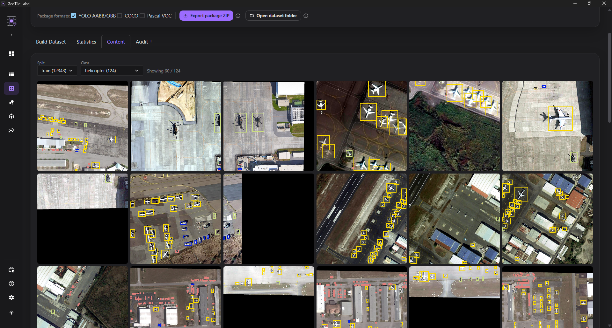

# Zawartość datasetu

**Cel.** Obejrzeć od środka **gotowy, opublikowany** dataset - realne kafelki z
narysowanymi ramkami i klasami - zanim zaufasz metrykom i puścisz trening.

**Gdzie.** Zakładka **Zawartość** w module Dataset, obok Statystyk i Audytu. Dotyczy
wybranej wersji datasetu (runu), nie stanu projektu przed budową.

*Kafelki tak, jak trafiły do treningu - z ramkami obiektów.*

## Co widać

Siatka kafelków wybranego zbioru. Na każdym kaflu są **kolorowe ramki obiektów**, bez
podpisów na obrazie - podpisy zasłaniałyby treść, a przy wielu klasach rozjeżdżałyby
równość kafelków w galerii. Klasę rozpoznasz po kolorze ramki, a pełną **legendę kolorów**
(tylko klasy z danego kafelka) pokazuje **powiększenie** po kliknięciu.

Filtry zawężają widok do jednego **zbioru** (uczący / walidacyjny / testowy) i jednej
**klasy** - wybór klasy jest zarazem najszybszym sposobem, by odczytać jej kolor. Przy
dużych datasetach kafelki doczytują się przyciskiem **Załaduj więcej** - widok nie wczytuje
tysięcy obrazów naraz.

!!! info "To zamrożony artefakt, nie podgląd na żywo"

    Widzisz dokładnie to, co poszło do treningu w tej wersji: konkretny podział,
    wyrenderowane kafelki i dokładne ramki. Wersja jest niezmienna - nic tu nie edytujesz.

## Od kafelka do sceny

Klik w kafelek otwiera powiększenie z ramkami, **legendą klas** i przyciskiem **Otwórz
scenę w tym miejscu**. Przenosi on do edytora ustawionego na tym fragmencie sceny.

!!! warning "Poprawka tworzy nową wersję datasetu"

    Deep-link otwiera **żywą scenę**, nie zamrożony kafelek. Poprawki nanosisz na
    adnotacje sceny, a do modelu trafiają dopiero przez **ponowne wygenerowanie**
    datasetu. Bieżąca wersja pozostaje nietknięta - dzięki temu wynik treningu wciąż
    da się z nią powiązać.

## Kiedy tu zaglądać

- **Przed treningiem** - zobaczyć, co faktycznie idzie do modelu, zamiast ufać samym
  liczbom.
- **Po audycie** - obejrzeć konkretne przypadki, które zgłosiła [kontrola](audyt.md).
- **Do wyłapania błędów** - źle wyrenderowany kafelek, ramka nie na obiekcie,
  pomylona klasa. Stąd jednym kliknięciem wracasz do edytora.

## Powiązane

- [Statystyki datasetu](statystyki.md) - rozkłady i wykorzystanie scen
- [Audyt](audyt.md) - gotowość wersji do treningu
- [Uruchom trening](../training/uruchom-trening.md) - kolejny krok
