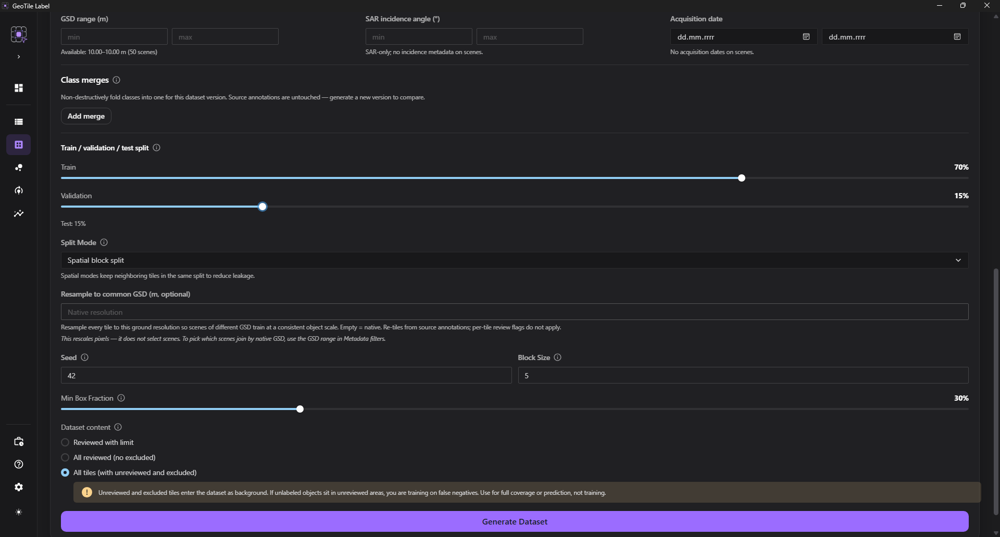

# Zbuduj dataset

**Cel.** Wygenerować wersjonowany zestaw obrazów treningowych z podziałem na zbiory.

**Kiedy.** Gdy labelowanie jest na tyle zaawansowane, że warto sprawdzić model.

**Wymagania.** Utworzony [katalog kafelków](katalog-kafelkow.md).

## Kroki

1. Otwórz moduł **Dataset**.
2. Wybierz profil preprocessingu.
3. Sprawdź **Siatkę kafli** (rozmiar i nakładanie) - jest **dziedziczona z [Siatki przeglądu](../annotation/siatka-przegladu.md)** i pokazana tylko do wglądu.
4. Wybierz strategię podziału i proporcje zbiorów.
5. Wybierz **Zawartość datasetu** (a w trybie *Sprawdzone z limitem* ustaw **Udział pustych kafelków**).
6. Opcjonalnie ustaw **Wspólny GSD** (przepróbkowanie do jednej rozdzielczości terenowej).
7. Opcjonalnie zawęź **Filtry źródeł datasetu**.
8. Opcjonalnie zawęź **Filtry metadanych** (zakres `GSD`, kąta padania SAR, daty akwizycji).
9. Opcjonalnie **połącz podobne klasy** (Łączenie klas).
10. Wybierz **Generuj dataset**.

Budowanie uruchamia trwałe zadanie `dataset_build`. Możesz przejść do innego widoku;
postęp, anulowanie i ponowienie są dostępne w
[Zadaniach w tle](../reference/zadania-w-tle.md).

!!! info "Wersja pojawia się dopiero po ukończeniu"

    Obrazy i etykiety są zapisywane do katalogu tymczasowego. Wskaźnik wersji zostaje
    opublikowany atomowo dopiero po zakończeniu wszystkich etapów i audytu. Przerwany
    katalog `.partial` nie jest trenowalnym datasetem i może zostać bezpiecznie
    wyczyszczony lub wykorzystany przez kontrolowane wznowienie.

*Konfiguracja przed wygenerowaniem wersji datasetu.*

## Siatka kafli

Rozmiar kafla i nakładanie są pokazane u góry konfiguracji **tylko do wglądu** - pochodzą z
[Siatki przeglądu](../annotation/siatka-przegladu.md). To celowe: dataset jest kaflowany
dokładnie tak, jak go przeglądasz (ten sam katalog kafli), więc obowiązuje zasada **co
przeglądasz = na czym trenujesz**.

!!! info "Dlaczego nie zmienia się siatki tutaj"

    Zmiana rozmiaru kafla przebudowałaby katalog kafli i **wyzerowała stan przeglądu**
    (sprawdzone / wykluczone / puste komórki), bo tożsamość kafla zależy od jego rozmiaru.
    Dlatego parametry siatki zmienia się w **Siatce przeglądu**, a Build tylko je dziedziczy.
    Jeśli potrzebujesz innej skali obiektu bez ruszania przeglądu, użyj
    [Wspólnego GSD](#wspolny-gsd-opcjonalnie) (re-tiling ze źródła).

## Punkt kontrolny

Powstaje **wersja datasetu** widoczna na liście, z własną konfiguracją i statystykami.
Poprzednie wersje pozostają nietknięte.

## Co trafia do modelu

Niezależnie od formatu źródła (`GeoTIFF`, `COG`, `JP2`, `NITF`, paczki dostawców)
każdy kafel datasetu jest zapisywany jako **8-bitowy, 3-kanałowy obraz**.
**Profil preprocessingu** decyduje, jak źródło zostanie do tej postaci sprowadzone -
przede wszystkim jak wartości (np. `UInt16`, panchromatyczne) są rozciągane do 8 bitów.

Wynika z tego, co model **widzi**, a czego nie:

- **głębia bitowa** źródła nie jest przenoszona - liczy się rozciągnięcie z profilu,
  a nie surowy zakres wartości;
- do kafla trafiają **trzy kanały**; dla scen wielopasmowych wybór, które pasma są
  renderowane jako `RGB`, robisz w oknie labelowania (patrz
  [Produkty pochodne](../input-data/produkty-pochodne.md));
- **rozdzielczość terenowa** (`GSD`) nie jest domyślnie wyrównywana między scenami -
  służy do tego opcjonalne pole [Wspólny GSD](#wspolny-gsd-opcjonalnie) poniżej.

!!! info "Regulacje wyświetlania to nie preprocessing"

    Suwaki jasności/kontrastu i rozciągnięcie histogramu w oknie labelowania zmieniają
    **tylko podgląd**. To profil preprocessingu - nie ustawienia wyświetlania - określa
    piksele zapisane w kaflach datasetu.

## Strategie podziału

| Strategia | Kiedy |
| --- | --- |
| Losowanie kafelków | dane jednorodne, szybki sprawdzian |
| Podział według scen | różne akwizycje albo obszary |
| Bloki obrazu | dane `NO GEO` |
| Bloki przestrzenne | dane `GEO` |
| Podział przestrzenny z równoważeniem klas | rzadkie klasy w danych `GEO` |

!!! warning "Losowanie kafelków zwykle zawyża wynik"

    Sąsiadujące kafelki zachodzą na siebie i pokazują ten sam teren. Przy losowaniu
    część trafia do zbioru uczącego, a część do testowego - model widzi więc test w
    trakcie nauki i wynik wychodzi lepszy, niż jest w rzeczywistości. To **przeciek
    przestrzenny**.

    Dla danych satelitarnych używaj podziału scenowego albo blokowego. Losowanie
    zostaw na szybkie sprawdzenie, czy pipeline w ogóle działa.

Po zbudowaniu wersji [audyt](audyt.md) sprawdza, czy podział nie wprowadził przecieku
przestrzennego ani sąsiedztwa kafelków między zbiorami, i czy każda konfiguracja
akwizycji z walidacji i testu występuje też w zbiorze uczącym.

## Zawartość datasetu

Pole **Zawartość datasetu** decyduje, które kafle trafiają do wersji. To wybór
jednokrotny - trzy poziomy inkluzywności ułożone w drabinę:

| Tryb | Kafle z adnotacjami | Sprawdzone puste | Niesprawdzone | Wykluczone |
| --- | --- | --- | --- | --- |
| **Sprawdzone z limitem** (domyślny) | ✅ | próbka wg suwaka | ❌ | ❌ |
| **Wszystkie sprawdzone (bez wykluczonych)** | ✅ | wszystkie | ❌ | ❌ |
| **Wszystkie kafle** | ✅ | wszystkie | ✅ | ✅ |

W trybie **Sprawdzone z limitem** liczbę pustych reguluje suwak **Udział pustych
kafelków** - jest to odsetek *względem liczby kafli z adnotacjami*, a nie odsetek
wszystkich kafli (100% ≈ jeden pusty na jeden pozytywny). Suwak działa tylko w tym trybie.

Puste przykłady uczą model, czego **nie** oznaczać. Bez nich model częściej zgłasza
fałszywe wykrycia na tle.

!!! warning "Tryb „Wszystkie kafle" wciąga niesprawdzone i wykluczone"

    Kafle niesprawdzone i wykluczone trafiają wtedy do datasetu jako tło. Jeśli w
    nieobejrzanych obszarach są nieopisane obiekty, uczysz model **fałszywych negatywów**.
    Ten tryb służy do pełnego pokrycia lub predykcji, **nie** do treningu.

!!! info "Puste nie są losowane z obszarów niesprawdzonych"

    W trybach sprawdzonych zależność jest prosta: im więcej fragmentów potwierdzonych jako
    puste, tym większy zapas materiału negatywnego. Jeśli spodziewasz się więcej pustych
    kafelków, sprawdź postęp [siatki przeglądu](../annotation/siatka-przegladu.md).

## Filtry źródeł

Sekcja **Filtry źródeł datasetu** pozwala zawęzić wersję do wybranych scen, klas,
autorów albo źródeł adnotacji. Brak zaznaczenia oznacza użycie wszystkiego.

Każda wersja zapisuje **własny snapshot filtrów** oraz listę faktycznie użytych
kafelków. Dzięki temu kolejne wersje mogą korzystać z tego samego katalogu z zupełnie
inną konfiguracją i pozostają porównywalne.

!!! tip "Filtr autora do sprawdzenia spójności zespołu"

    Zbudowanie wersji z pracy jednego analityka i porównanie jej ze zbiorczą potrafi
    ujawnić rozjazd w interpretacji klas - szybciej niż przeglądanie adnotacji ręcznie.

## Filtry metadanych

Sekcja **Filtry metadanych** zawęża wersję po **właściwościach scen**, a nie po tym, kto i
co oznaczył. Każdy filtr to zakres - puste pole = brak ograniczenia z tej strony:

- **Zakres GSD (m)** - tylko sceny o rozdzielczości terenowej w podanym przedziale;
- **Kąt padania SAR (°)** - tylko sceny o kącie padania w przedziale (pole radarowe);
- **Data akwizycji (od / do)** - tylko sceny zarejestrowane w danym oknie czasowym.

Typowe zastosowania: **hold-out czasowy** (ucz na starszych scenach, oceniaj na nowszych),
zawężenie do jednego reżimu geometrii radaru albo odsianie zobrazowań o skrajnym `GSD`.

!!! warning "Scena bez danej metadanej jest wykluczana"

    Gdy filtr jest aktywny, a scena nie ma tej informacji, zostaje **pominięta** (nie da
    się jej zweryfikować). Kąt padania jest metadaną radarową - jego filtr odrzuci więc
    sceny optyczne. Licznik „X z Y scen" nad sekcją pokazuje na bieżąco, ile scen przejdzie
    zestaw filtrów; podpowiedzi „Dostępne: …" pojawiają się po przebudowie katalogu kafelków
    tą wersją aplikacji.

Jak filtry źródeł, tak i te trafiają do **snapshotu wersji** - dobór scen jest zapisany w
manifeście i odtwarzalny.

## Łączenie klas

Gdy [analiza datasetu](analiza.md) pokazuje, że dwie klasy są wizualnie nierozróżnialne, sekcja
**Łączenie klas** pozwala **scalić je w jedną** na potrzeby danej wersji datasetu - bez ruszania
źródłowych adnotacji.

W grupie scalenia wybierasz **klasę wiodącą** (jej nazwa i identyfikator zostają) oraz zaznaczasz
klasy **wcielane** do niej. Przy generowaniu adnotacje klas wcielanych dostają klasę wiodącą, więc
model uczy się ich jako jednej. Klasa może należeć tylko do jednej grupy.

!!! info "Nieniszczące i odwracalne"

    Scalenie dotyczy **tylko generowanej wersji** - źródłowe adnotacje pozostają nietknięte.
    Zmiana scaleń to zmiana konfiguracji, więc powstaje **nowa wersja** datasetu; łatwo więc
    zbudować wariant scalony i porównać go z niescalonym (analiza, trening, Wyniki).

!!! note "Klasa wcielana zostaje na liście, ale pusta"

    Dla spójności z formatem treningowym lista klas modelu pozostaje pełna. Klasa wcielona nie ma
    już własnych instancji (jej liczności trafiają do wiodącej), więc w statystykach wersji pojawi
    się z zerem - to oczekiwane i potwierdza, że scalenie zadziałało.

## Wspólny GSD (opcjonalnie)

Sceny o różnej rozdzielczości przestrzennej (`GSD`, metry/piksel) dają obiekty w różnej
skali pikselowej - a model uczy się na kaflach o stałym rozmiarze. Pole **Wspólny GSD**
pozwala **przepróbkować każdy kafel do jednej rozdzielczości terenowej**, żeby obiekty miały
spójną skalę niezależnie od sceny. Puste = rozdzielczość natywna (domyślnie).

Jak to działa:

- kafel wyjściowy ma dalej ustawiony rozmiar w pikselach; zmienia się **obszar terenu**
  odczytywany ze sceny (`window = rozmiar · GSD_sceny / GSD_docelowy`) i jest przepróbkowany;
- w tym trybie dataset jest **kaflowany na nowo z adnotacji źródłowych**, więc **flagi
  przeglądu per-kafel nie obowiązują** (działają wykluczenia i filtry na poziomie sceny);
- sceny **bez znanego `GSD`** są pomijane, a build zgłasza to w ostrzeżeniach.

!!! tip "Kiedy używać"

    Włączaj, gdy mieszasz w jednym datasecie sceny o wyraźnie różnym `GSD`. Dla jednorodnej
    rozdzielczości zostaw puste - natywne kaflowanie jest wtedy dokładniejsze i szybsze.

!!! info "Wspólny GSD to nie to samo co filtr GSD"

    **Wspólny GSD** *przeskalowuje piksele* wszystkich scen do jednej rozdzielczości.
    **Zakres GSD** w [Filtrach metadanych](#filtry-metadanych) *wybiera, które sceny* w
    ogóle wejdą - nie zmienia pikseli. Można ich użyć razem: najpierw zawęź populację
    zakresem, potem znormaluj skalę wspólnym GSD.

## Wersja jest niezmienna

Każde użycie **Generuj dataset** tworzy nową, niezmienną wersję. Historię można
przeglądać i eksportować niezależnie, a wersje porównywać między sobą.

## Kasowanie wersji datasetu

W historii runów (przycisk **Historia** nad zakładkami) każdy wiersz ma opcję **Usuń**.
Kasowanie jest **trwałe** - usuwa katalog wersji z dysku i z listy; nie ma kosza.

Obowiązuje **miękka bramka rodowodu**: jeśli z wersji zbudowano przebiegi treningu lub
zarejestrowano modele, albo wersja jest opublikowana, okno pokazuje listę zależnych
artefaktów i wymaga świadomego potwierdzenia. Po wymuszeniu zależne artefakty pozostają,
ale **osierocone** - nie da się już prześledzić ich rodowodu do danych. Skasowanie
najnowszej wersji przepina wskaźnik „latest" na następną i odświeża podręczny cache.

!!! tip "Do czego to służy"

    Głównie do odzyskania miejsca po nieudanych albo eksperymentalnych wersjach oraz po
    ciężkich zbiorach benchmarkowych. Wersję przeznaczoną do treningu zwykle nie kasujesz -
    utrzymuje odtwarzalność modeli z niej wytrenowanych.

## Następny krok

Sprawdź [statystyki](statystyki.md) i [audyt](audyt.md), a wersję przeznaczoną do
treningu [opublikuj](publikowanie.md).
