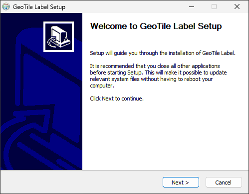

# Instalacja

**Cel.** Zainstalować GeoTile Label i sprawdzić, że aplikacja startuje.

**Kiedy.** Przed pierwszym użyciem oraz przy przejściu na nowszą wersję.

## Wymagania

- Windows 10 albo 11, 64-bitowy;
- instalator `GeoTile Label_<wersja>_x64-setup.exe`, pobrany z
  [Releases](https://github.com/jakubslesinski/geotile-label/releases);
- dostęp do scen, plików metadanych i pliku klas;
- folder przeznaczony na projekty.

!!! info "Nie instalujesz Pythona ani niczego dodatkowo"

    Instalator zawiera aplikację razem ze środowiskiem backendu, bibliotekami GEO i
    predykcją działającą na procesorze. Docker, Python, Node.js i Rust nie są
    potrzebne.

## Kroki

1. Uruchom plik `.exe`.
2. Jeżeli Windows SmartScreen ostrzeże przed nieznanym wydawcą, wybierz **Więcej
   informacji → Uruchom mimo to** - pod warunkiem, że plik pochodzi z zaufanego
   źródła w Twojej organizacji.
3. Zakończ instalację i uruchom GeoTile Label z menu Start.

*Ostrzeżenie SmartScreen przy niepodpisanym instalatorze.*

## Punkt kontrolny

Aplikacja otwiera się na liście projektów. **Pierwsze uruchomienie trwa dłużej** -
rozpakowywane jest środowisko backendu. Kolejne starty są szybkie.

Jeżeli okno pozostaje puste albo pojawia się komunikat o backendzie, przejdź do
[Aplikacja nie startuje](../troubleshooting/aplikacja-nie-startuje.md).

## Co zostało zainstalowane

Instalacja bazowa obejmuje **labelowanie, narzędzia AI i predykcję** - wszystko działa
na procesorze i nie wymaga karty graficznej.

!!! warning "Trenowanie modeli wymaga osobnego pakietu"

    Zakładka **Trening** będzie widoczna, ale architektury pozostaną niedostępne,
    dopóki nie zainstalujesz [pakietu treningowego GPU](pakiet-gpu.md). To osobny
    plik, nie część instalatora.

Dane aplikacji trafiają do `%APPDATA%\GeoTileLabel`; pełny wykaz znajduje się w
[Lokalizacjach danych](../reference/lokalizacje-danych.md).

## Aktualizacja do nowszej wersji

Zainstaluj nową wersję na dotychczasowej - projekty i ustawienia pozostają nietknięte,
ponieważ leżą poza katalogiem programu.

!!! warning "Pakiet GPU musi pasować do wersji aplikacji"

    Runtime treningowy jest wydawany razem z aplikacją. Po aktualizacji zainstaluj
    pakiet w tej samej wersji, którą ma aplikacja.

## Następny krok

[Szybki start analityka](szybki-start-analityka.md) prowadzi od pustej aplikacji do
pierwszej zapisanej adnotacji.
