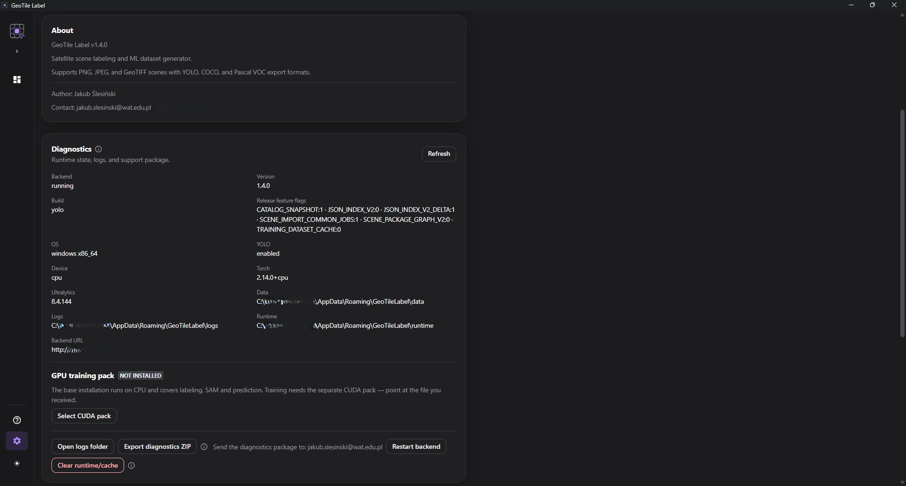

# Pakiet treningowy GPU

**Cel.** Włączyć trenowanie modeli na karcie NVIDIA.

**Kiedy.** Tylko wtedy, gdy zamierzasz **trenować modele**. Labelowanie, narzędzia AI
i predykcja działają bez tego pakietu.

## Dlaczego to osobny plik

Biblioteki CUDA ważą kilka gigabajtów i nie mieszczą się w instalatorze. Dzięki
wydzieleniu ich analityk instaluje niecały gigabajt zamiast kilku, a pakiet pobiera
tylko ten, kto faktycznie trenuje.

Pakiet wskazuje się **ręcznie**. Aplikacja niczego nie pobiera z sieci.

## Wymagania

- karta NVIDIA ze sterownikiem obsługującym CUDA 12.6;
- około 6,5 GB wolnego miejsca na dysku;
- pakiet w **tej samej wersji**, co zainstalowana aplikacja.

## Skad wziac pakiet

Pakiet **nie jest publikowany jako zalacznik wydania** - sam runtime CUDA wazy okolo
3 GB, czyli wiecej, niz sensownie niesie zalacznik. Budujesz go sam z tego repozytorium,
na maszynie z dostepem do sieci:

```powershell
# 1. Wagi bazowe YOLO, jesli jeszcze ich nie masz - repozytorium ich nie niesie.
powershell -ExecutionPolicy Bypass -File .\scripts\fetch-base-models.ps1

# 2. Sam pakiet.
powershell -ExecutionPolicy Bypass -File .\scripts\build-cuda-pack.ps1
```

Krok 1 pobiera wagi do `data/models/base`. Bez niego budowa ostrzega i tworzy pakiet
**bez archiwum wag**, a zakladka Trening pokazuje wtedy wszystkie architektury jako
niedostepne z powodem "Weights are missing locally". Pomijaj go swiadomie tylko przez
`-SkipBaseModels`, gdy maszyna docelowa juz je ma.

Wynik trafia do `release/cuda-pack-<wersja>/` razem z sumami kontrolnymi i README dla
osoby instalujacej. Skrypt pobiera kola PyTorch pod CUDA 12.6, wiec pierwsze uruchomienie
trwa. `-PartSizeMB` tnie archiwum, gdy nosnik albo kanal przesylu ma limit rozmiaru pliku,
a `-SkipBaseModels` pomija wagi, gdy na maszynie docelowej juz sa.

Buduj z **tej samej rewizji**, z ktorej pochodzi uzywany instalator - pakiet i aplikacja
sa wersjonowane razem, a aplikacja odrzuca pakiet z innej wersji.

## Co dostajesz

Folder pakietu zawiera dwa archiwa oraz sumy kontrolne:

| Plik | Zawartość |
| --- | --- |
| `geotile-cuda-runtime-<wersja>.tar.gz` | środowisko z PyTorch pod CUDA |
| `geotile-base-models-<wersja>.tar.gz` | wagi bazowe architektur |
| `SHA256SUMS.txt` | sumy kontrolne do weryfikacji |

Duży plik runtime bywa pocięty na części (`.001`, `.002`, …). To normalne - części
składane są przy instalacji.

## Kroki

1. Skopiuj **wszystkie** pliki pakietu na komputer z kartą NVIDIA.
2. Otwórz **Ustawienia → Pakiet treningowy GPU**.
3. Wybierz **Wskaż pakiet CUDA**.
4. W oknie wyboru zaznacz **wszystkie pliki naraz**, łącznie z archiwum wag i
   ewentualnymi częściami.
5. Poczekaj na zakończenie instalacji.
6. **Uruchom aplikację ponownie.**


*Sekcja pakietu treningowego w Ustawieniach.*

!!! warning "Zaznacz wszystkie pliki, nie tylko runtime"

    Archiwum wag jest osobne od runtime. Wskazanie samego runtime zainstaluje
    środowisko, ale zakładka **Trening** pokaże architektury jako niedostępne z
    powodem „brak wag lokalnie". Pliki można też wskazać osobno, w dwóch podejściach.

## Punkt kontrolny

Po ponownym uruchomieniu w **Ustawieniach** przy pakiecie widnieje **Runtime GPU jest
aktywny**.

Restart jest konieczny, ponieważ środowisko wybierane jest przy starcie aplikacji.
Do tego czasu widoczny pozostaje komunikat o konieczności ponownego uruchomienia.

## Gdy pakiet nie zadziała

Po rozpakowaniu aplikacja sprawdza pakiet sondą. Gdy sonda nie przejdzie, pakiet
zostaje **usunięty**, a aplikacja dalej pracuje na środowisku procesorowym.

!!! info "Nieudana instalacja nie psuje działającej aplikacji"

    To celowe zabezpieczenie: niekompatybilny pakiet nie może zablokować labelowania.
    Najczęstsza przyczyna odrzucenia to sterownik starszy niż wymaga CUDA 12.6 albo
    niekompletny zestaw części archiwum.

Weryfikacja pobranych plików w PowerShell:

```powershell
Get-FileHash .\geotile-cuda-runtime-<wersja>.tar.gz -Algorithm SHA256
```

Wynik porównaj z `SHA256SUMS.txt`.

## Co dalej

Architektury dostępne po instalacji opisuje
[Architektury bazowe](../reference/architektury.md), a pierwszy trening -
[Uruchom trening](../training/uruchom-trening.md).
