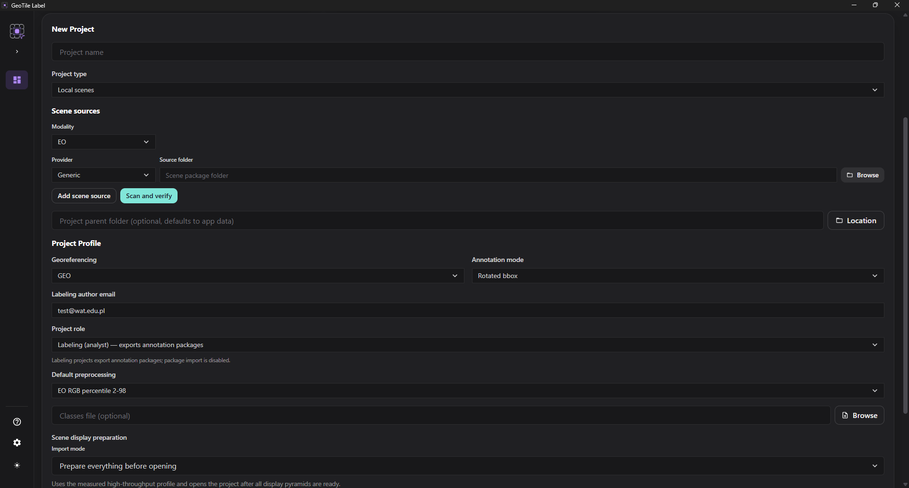

# Szybki start analityka

**Cel.** Od pustej aplikacji do pierwszej zapisanej adnotacji.

**Czas.** Około 15 minut.

**Czego potrzebujesz.** Zainstalowanej aplikacji, folderu z paczkami scen jednego
dostawcy i pliku `classes.json`, jeśli zespół go ustalił.

## 1. Utwórz projekt

W widoku **Projekty** na górze są projekty istniejące, a niżej formularz nowego.

1. Podaj nazwę projektu.
2. Dodaj źródło: wybierz dostawcę i folder z jego paczkami.
3. Opcjonalnie wskaż folder nadrzędny na projekt. Bez wskazania projekt trafi do
   lokalizacji domyślnej.
4. Ustaw profil projektu:
   - **modalność** - `EO` albo `SAR`;
   - **georeferencja** - `GEO` albo `NO GEO`;
   - **tryb adnotacji** - Ramka albo Ramka zorientowana;
   - **e-mail autora** labelowania;
   - domyślny profil preprocessingu i strategię podziału.
5. Utwórz projekt.

!!! info "Dostawcy nie wybierasz drugi raz"

    Dostawca i sensor wynikają ze źródeł scen i metadanych wykrytych podczas
    skanowania. W profilu projektu ich nie ma.

!!! warning "Trybu adnotacji nie zmienisz później bez konsekwencji"

    Wybór między ramką osiową a zorientowaną decyduje o tym, jakie architektury
    będzie można trenować i jak wyglądają eksporty. Ustal go z zespołem przed
    rozpoczęciem pracy.

*Formularz nowego projektu.*

## 2. Zaimportuj klasy

1. Otwórz projekt.
2. W sekcji **Klasy** wybierz **Importuj z pliku**.
3. Wskaż `classes.json`.

Klasy z przypisanymi numerami skrótów będzie można wybierać klawiszami ++1++–++9++.

## 3. Zaimportuj sceny

1. Przy dodanym źródle użyj **Skanuj i sprawdź**.
2. Przejrzyj tabelę rozpoznanych scen.
3. Sceny ze statusem **wymaga decyzji** wymagają wskazania produktu.
4. Zatwierdź import.

**Punkt kontrolny.** W katalogu scen widzisz sceny ze statusem **gotowa**. Znaczenie
pozostałych statusów opisuje [Statusy scen](../reference/statusy-scen.md).

## 4. Narysuj pierwszą adnotację

1. Otwórz scenę z katalogu.
2. Wybierz klasę - klawiszami ++1++–++9++ albo przez wyszukiwarkę (++k++).
3. Włącz tryb rysowania klawiszem ++d++.
4. Narysuj ramkę wokół obiektu.

**Punkt kontrolny.** Adnotacja pojawia się na liście obok mapy, a na scenach `GEO`
widać wyliczone wymiary w metrach.

*Pierwsza adnotacja na scenie.*

!!! tip "Adnotacje zapisują się same"

    Nie ma osobnego przycisku zapisu. Praca trafia do pliku sceny w folderze
    projektu na bieżąco.

## 5. Oznacz sprawdzony obszar

Siatka przeglądu pozwala zapisać, które fragmenty sceny zostały już obejrzane -
również te, w których nic nie znalazłeś.

1. Przejdź do zakładki **Siatka przeglądu**.
2. Utwórz siatkę w sekcji **Konfiguracja siatki**.
3. Włącz tryb **Oznacz sprawdzone** i klikaj albo przeciągaj po komórkach.

**Punkt kontrolny.** Pasek postępu i licznik sprawdzonych komórek rosną.

!!! info "Sprawdzone puste obszary też są informacją"

    Model uczy się nie tylko tego, co ma wykrywać, ale i tego, gdzie obiektów nie ma.
    Odróżnienie „sprawdzone i puste" od „jeszcze nieobejrzane" jest tu kluczowe.

## 6. Przekaż pracę

Gdy scena jest gotowa, wyeksportuj **paczkę adnotacji** i przekaż ją managerowi.

!!! warning "Paczka adnotacji, nie backup"

    Backup odtwarza cały projekt jako nowy. Do przekazania pracy służy paczka
    adnotacji, która dołącza labele do projektu zbiorczego. Patrz
    [Rodzaje paczek](../reference/rodzaje-paczek.md).

## Co dalej

- Pełny cykl danych: [Od sceny do datasetu](od-sceny-do-datasetu.md)
- Wszystkie skróty: [Skróty klawiaturowe](../reference/skroty.md)
- Obieg poprawek: [Workflow analityka](../teamwork/workflow-analityka.md)
