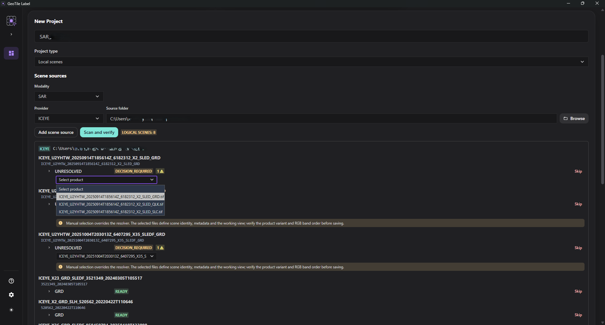
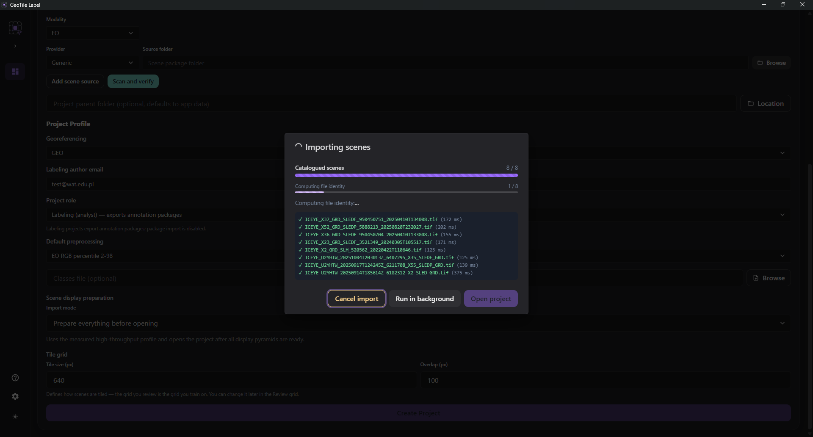

# Import scene packages

**Goal.** Connect a vendor folder and add recognized scenes to a project.

**When.** When creating a project or adding new acquisitions.

**Prerequisites.** An existing project and a folder containing packages from **one
vendor**.

## Arrange the source folder

Keep the original nesting and filenames. GeoTile Label recognizes products from the
vendor structure and naming conventions. A project can connect multiple sources, but
they must use the same modality: `SAR` or `EO`.

```text
vendor_folder/
├── scene_package_001/
│   ├── raster or raster parts
│   └── vendor metadata
├── scene_package_002/
│   └── ...
└── ...
```

## Steps

1. Add a scene source and select its vendor and package directory.
2. Select **Scan and verify**.
3. Review the [recognized scene tree](#what-the-preview-shows) and its statuses.
4. Resolve entries marked **decision required**. For WorldView `MUL+PAN`, also confirm
   the RGB band indices.
5. Select an [import mode](#import-modes).
6. Confirm the import. Progress remains available under
   [Background jobs](../reference/zadania-w-tle.md).




*Import runs as a job - it can be sent to the background or cancelled.*

## What the preview shows

The scan result is arranged hierarchically:

```text
Source
└── Delivery
    └── Acquisition
        ├── GRD VV - ready
        ├── GRD VH - ready
        └── MUL 2 + PAN 2 - preparation required
```

This makes it immediately visible which products come from the **same pass** and which
are separate acquisitions inside one folder.

A product row carries only what helps you spot a problem: the product label with
polarization or bands, the status, warning and conflict counts, and completeness -
**only when it is partial**. A complete set of parts needs no attention.

Expanding a row shows the details of that one product: why it was selected
automatically, the file breakdown by role, missing parts, warning texts, the related
archive, and - for products that need preparation - the estimated output size and free
space.

ZIP archives found next to deliveries are listed with their delivery. They are not
scenes and are never imported; their states are described in
[Scene statuses](../reference/statusy-scen.md#entries-that-are-not-scenes).

## Import modes

| Mode | Use it when | Behavior |
| --- | --- | --- |
| **Quick import (on demand)** | work should start immediately | catalog and identity are created first; expensive preparation starts when needed |
| **Prepare overviews in background** | normal work with many large scenes | scenes become available after cataloging while overviews continue in the background |
| **Prepare everything before opening** | preparing an offline workstation | import waits for all working views and overviews |

The currently opened scene receives higher priority. Import can be cancelled and
resumed, and missing overviews can be completed later. Closing the dialog does not
stop the job.

!!! info "Import overview versus full JP2 resolution"

    Import modes control the fast `overview.vrt` + `overview.vrt.ovr` display path.
    They do not build a full-resolution COG. For a large generic JP2, the 1× COG may
    be queued only after the scene is opened and its preview has loaded, provided
    **Automatic full-resolution COG** in the **Scene sources** card is **ON**. Setting
    it **OFF** does not change or extend import itself; it prevents the later automatic
    COG job.

    See [Derived products](produkty-pochodne.md#large-generic-jp2-2-preview-and-full-resolution-1)
    for the complete workflow and memory policy.

!!! tip "Prebuilt overviews"

    If a valid `scene.tif.ovr` exists next to the raster, GeoTile Label reuses it
    instead of building a redundant project copy. See
    [QGIS overviews and sidecars](piramidy-qgis.md).

## Import report

When the import finishes you can copy a **report** - one document describing every
scene: the reason for its status, recognition diagnostics, completeness, file counts by
role, stage timings and overview state. The error list is never truncated, so the cause
is there even for an import counted in hundreds of scenes.

Two copy variants are available: full, and **without paths** - the latter replaces paths
and filenames with stable hashes, so the report can be shared without exposing the
directory structure.

## Migrate an existing project

After package-recognition rules change, select **Check migration** in the **Scene
sources** header. The first step is a dry-run only: it lists unchanged scenes,
automatic migrations, scenes requiring a choice, and unavailable sources. The project
is not modified at this stage.

When an old package resolves into several products, choose the correct **Successor**
for every ambiguous scene. Apply remains disabled while any available choice is
unresolved. Applying the migration:

- rescans the sources and rejects a stale or no-longer-offered choice;
- backs up `scene.json` and `scene_manifest.json`;
- preserves the scene directory, `scene_id`, and annotations;
- stores the complete successor package and user-decision provenance;
- keeps working views and overviews in place while reporting what needs rebuilding.

A scene with an unavailable source or no possible successor is marked **migration
required** and cannot be opened for labeling. Restore the source and run the check
again.

## Source changed during the scan

A file-state snapshot is taken before and after the scan. If anything changes in
between, the result is **not published** as a preview; you get a source-changed message
instead. This prevents cataloguing a folder captured in two different states.

## Checkpoint

The catalog lists usable scenes as **ready**. An overview badge may still say queued
or building; the scene is usable, but its first low-scale render may be slower.

Source files remain read-only. The project stores source identity, scene catalog,
CRS/transform/lineage metadata, overview type and fingerprint, and any required
working views under `derived_scenes\`.

## Common problems

**All scenes require a decision.** Verify the selected vendor.

**Some packages are missing.** Check whether files were flattened into one directory
or renamed.

**A scene offers only the vendor logo JPGs.** The rasters sit deeper than the Windows
**260-character** path limit and were invisible to earlier versions - silently, because
the system reports them as *path not found*. The current version reads them correctly;
in a project scanned earlier, **re-scan the source**. If it recurs on this version,
shorten the delivery folder name - the longest raster path must fit together with the
network share prefix.

**Unsupported in this environment.** The installed GDAL runtime lacks the required
driver; report the case to the application team.

**Migration required.** Use **Check migration** next to the scene sources, review the
plan, and choose a successor. The application blocks opening this state so annotations
cannot be silently reused with a different raster.

!!! warning "Do not prepare the products outside the application"

    If a package contains a product from the
    [table of defaults](../reference/produkty-dostawcow.md), do not convert it
    beforehand. The application prepares the working view without changing any pixels
    and records the full provenance of the data. Converting by hand breaks that chain.

## Next step

Read [Derived products and working views](produkty-pochodne.md), then continue to
[Annotation](../annotation/index.md).
