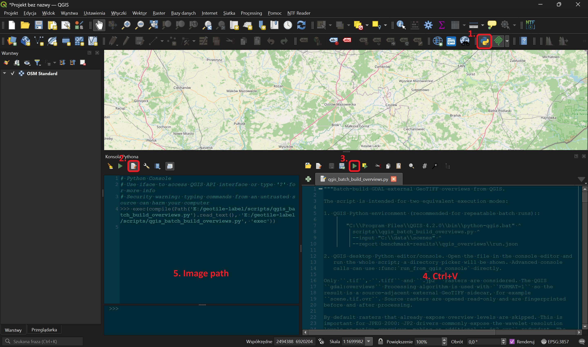

# QGIS overviews and sidecars

Large rasters open faster when they have **overviews**: reduced-resolution image
levels used at small map scales. GeoTile Label can build project overviews in the
background, or reuse an external sidecar prepared in QGIS.

## When to prepare overviews in QGIS

- before importing a large TIFF/GeoTIFF collection on a powerful workstation;
- when the same rasters will be used by QGIS and GeoTile Label;
- when the project should become usable without waiting for a long GDAL job;
- when derived products are prepared and verified in a separate workflow.

Native JP2 levels are not always sufficient for interactive display. For a large JP2
(256 megapixels or more by default), GeoTile Label builds a project-local
`overview.vrt.ovr`: decoding native OpenJPEG levels at high zoom can otherwise keep
the CPU busy for a long time. Smaller JP2 files with complete levels remain marked
as **native** and need no extra file.
The project JP2 overview is not resampled from full resolution. GeoTile Label copies
native level `2x`, `4x`, or `8x` into a tiled GeoTIFF and builds only the remaining
levels from that smaller raster. Selection is memory-adaptive to bound import-time
peak usage.

To prepare a large JP2 sidecar in QGIS ahead of time, pass
`force_external_for_native=True` in the controlled call. The resulting `.ovr` stays
next to the source and takes precedence over a project overview. The source raster
remains read-only.

## Output

The sidecar must remain **next to its raster** and use the full source name followed
by `.ovr`:

```text
scene.tif
scene.tif.ovr
```

Do not import the `.ovr` as a scene. GeoTile Label detects it automatically during
import, catalog refresh, and before image reads.

## Run it in QGIS

1. Start QGIS and open **Plugins → Python Console**, or press ++ctrl+alt+p++.
2. Select **Show Editor** in the console panel.
3. Create a script, paste [the code from this page](#complete-python-script), and save
   it as `qgis_batch_build_overviews.py`. You can also open the repository file:
   `scripts/qgis_batch_build_overviews.py` in the repository.
4. Run the whole file with **Run Script** or ++ctrl+shift+e++.
5. Select the raster directory in the system dialog. Subdirectories are scanned.
6. The console prints the independent worker PID and the report and log paths. QGIS
   remains responsive. JSON and CSV reports are updated after every raster in
   `<selected directory>\_geotile_overview_reports\`; per-raster `gdaladdo` logs are
   stored in the report-named directory ending in `_logs`.


*Open the console, show the editor, run the script, and select the source path.*

!!! info "The `exec(compile(...))` line is expected"

    QGIS prints the technical command used to execute the file. It is not an error.
    A directory picker should follow. If the script was loaded but the picker did not
    open, enter `run_from_qgis_console()` in the console.

The default profile uses `AVERAGE`, `DEFLATE`, one file and one GDAL thread at a time,
and levels `2, 4, 8, ...` down to roughly 512–1024 pixels on the longer edge. The GDAL
cache is capped at 512 MiB per process. Source files are opened read-only and checked
before and after processing.

## Interruption and hang resilience

QGIS is only a launcher. A separate `gdaladdo` process handles each raster, so a
driver or input failure cannot block the application UI. The worker:

- atomically checkpoints the report at startup and after every raster;
- records the PID, command, exit code, and time of the last activity;
- terminates a process with no CPU, log, or `.ovr` activity for 15 minutes;
- creates an `.ovr.geotile-building.json` transaction marker before each build;
- moves an uncertain sidecar to `.ovr.partial-<timestamp>` instead of deleting it;
- verifies every band's levels, reads distributed samples, and checksums the
  coarsest level to detect a header-only overview.

A marker left by an interrupted worker is handled on the next run. If its recorded
process is still alive, the new worker leaves the sidecar untouched. Otherwise, a
complete `.ovr` is validated and retained, while an incomplete one is quarantined and
rebuilt. Change the inactivity limit with `inactivity_timeout`; set it to `0` to
disable it. `max_file_seconds` provides an independent optional wall-clock limit.

## Controlled run

Load the script into an isolated namespace and perform a dry run before writing files:

```python
from pathlib import Path

script_path = Path(r"C:\path\to\geotile-label\scripts\qgis_batch_build_overviews.py")
scope = {"__name__": "qgis_overview_batch"}
exec(compile(script_path.read_text(encoding="utf-8"), str(script_path), "exec"), scope)

scope["run_from_qgis_console"](
    input_directory=r"C:\data\scenes",
    max_files=2,
    dry_run=True,
)
```

After reviewing the report:

```python
scope["run_from_qgis_console"](
    input_directory=r"C:\data\scenes",
    threads=1,
    gdal_cache_mb=512,
    inactivity_timeout=900,
    dry_run=False,
)
```

For a directory containing only large JP2 files, force sidecars despite native
levels:

```python
scope["run_from_qgis_console"](
    input_directory=r"C:\data\large-jp2",
    force_external_for_native=True,
    dry_run=False,
)
```

The flag applies to every raster with native or internal levels in the selected
directory. Do not use it unnecessarily on a mixed collection whose TIFF overviews
are already valid.

Reruns are safe: complete external overviews are skipped after content validation.
Without `force_external_for_native=True`, the script also skips sources with complete
native levels. A console call returns the worker PID instead of waiting for the whole
batch to finish.

## What GeoTile Label does after an `.ovr` changes

The application records the overview type, levels, and a cheap fingerprint. Adding,
removing, or replacing a sidecar invalidates dependent data:

- the scene thumbnail;
- histogram and display profile;
- reprojected tile cache;
- renderer context and the versioned tile URL.

A valid source `.ovr` takes precedence over a redundant project-local
`overview.vrt.ovr`. There is no separate “attach overviews” operation.

When a large JP2 has no source `.ovr`, the application marks its preparation as
`pending`, builds a project overview in the background, and refreshes the display
profile after completion. Until then, expensive JP2 reads use a separate bounded
queue, so they cannot block the project catalog or unrelated scenes.

An `.ovr` provides the fast preview but does not replace full 1× resolution. For an
eligible large generic JP2, GeoTile Label may prepare a separate validated COG after
the first viewport. Control this with **Automatic full-resolution COG** in the
**Scene sources** card; see
[Derived products](produkty-pochodne.md#large-generic-jp2-2-preview-and-full-resolution-1).

## Complete Python script

Expand the block and use the copy button in its top-right corner. The documentation
includes the repository source directly, avoiding a second copy that could become
out of date.

??? example "`qgis_batch_build_overviews.py` - click to expand"

    ```python
    --8<-- "scripts/qgis_batch_build_overviews.py"
    ```

## Related

- [Import scene packages](importuj-paczki.md)
- [Derived products and working views](produkty-pochodne.md)
- [Scene statuses](../reference/statusy-scen.md)
- [Scene does not open](../troubleshooting/scena-sie-nie-otwiera.md)
