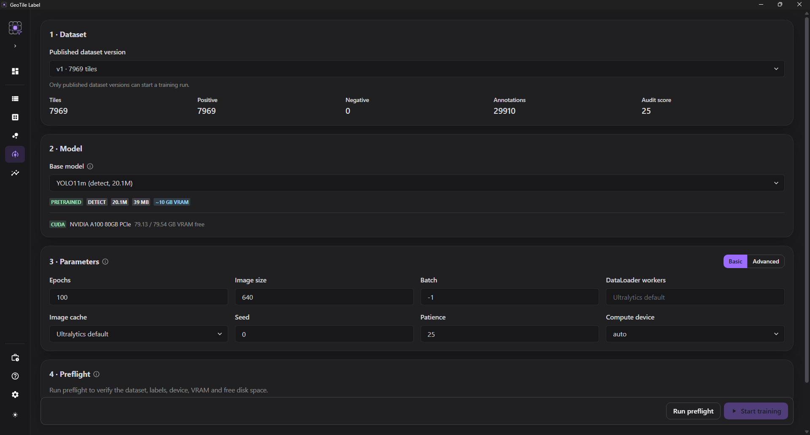

# Uruchom trening

**Cel.** Wytrenować model na opublikowanej wersji datasetu.

**Wymagania.** [Pakiet treningowy GPU](../getting-started/pakiet-gpu.md),
[opublikowana wersja datasetu](../datasets/publikowanie.md) i przygotowane wagi bazowe.

## Kroki

1. Otwórz zakładkę **Trening**.
2. Wybierz **dataset** z listy opublikowanych wersji.
3. Wybierz **Model bazowy**.
4. Ustaw parametry albo zostaw domyślne.
5. Wybierz **Uruchom preflight**.
6. Gdy kontrola przejdzie - **Rozpocznij trening**.

*Konfiguracja przed uruchomieniem treningu.*

## Podstawowe parametry

| Parametr | Znaczenie |
| --- | --- |
| **Epoki** | ile razy model przejdzie przez cały zbiór uczący |
| **Rozmiar obrazu** | do jakiego rozmiaru skalowane są kafelki |
| **Batch** | ile obrazów naraz; `-1` dobiera automatycznie do pamięci karty |
| **DataLoader workers** | ile procesów przygotowuje kolejne obrazy; zbyt wiele może zwiększyć RAM i pogorszyć pracę wolnego dysku |
| **Cache obrazów** | `auto`, wyłączony, `disk` albo `ram`; cache RAM wymaga zgody preflightu |
| **Ziarno losowania** | powtarzalność przebiegu |
| **Cierpliwość** | po ilu epokach bez poprawy trening się zatrzyma |

!!! tip "Zacznij od domyślnych i jednego małego modelu"

    Pierwszy przebieg ma odpowiedzieć na pytanie „czy ten dataset w ogóle się uczy",
    a nie dać najlepszy możliwy wynik. Rozmiar **n** i domyślne parametry wystarczą,
    żeby to sprawdzić w rozsądnym czasie.

Po preflighcie karta rekomendacji pokazuje rozpoznane wąskie gardło, proponowane
`batch/workers/cache`, estymację pamięci i uzasadnienie. **Zastosuj rekomendację** tylko
kopiuje wartości do formularza - konfigurację można jeszcze zmienić i ponownie
sprawdzić.

## Konfiguracja przez YAML

Poza formularzem dostępny jest edytor YAML dla parametrów zaawansowanych - na przykład
optymalizatora, tempa uczenia czy augmentacji.

!!! info "Część kluczy jest zarządzana przez aplikację"

    Klucze takie jak ścieżka danych, katalog wyjściowy czy wybór modelu są ustawiane
    automatycznie i **zostaną odrzucone**, jeśli wpiszesz je ręcznie. Aplikacja pilnuje
    w ten sposób spójności między wybranym datasetem, modelem a zapisanym przebiegiem.

Widoczne polecenie CLI jest **poglądowe** - pokazuje, jak wyglądałby ten sam trening
uruchomiony z wiersza poleceń. Służy do weryfikacji konfiguracji, nie do kopiowania
poza aplikację.

## Przebieg

Postęp widać w trakcie: numer epoki i metryki. Trening można **przerwać** - przebieg
zostanie oznaczony jako przerwany i zachowa dotychczasowe wyniki.

Przebieg jest również widoczny w [Zadaniach w tle](../reference/zadania-w-tle.md).
Manifest zapisuje wartości żądane i efektywne, aby później było wiadomo, jaki batch,
liczba workerów i cache rzeczywiście zostały użyte.

!!! warning "Zamknięcie aplikacji przerywa trening"

    Trening działa jako proces potomny aplikacji. Zamknięcie okna go zatrzymuje.
    Przebieg zostaje wtedy oznaczony jako **przerwany z zewnątrz** - aplikacja wykrywa,
    że proces zniknął, zamiast zostawiać go w stanie „w toku" na zawsze.

## Statusy przebiegu

| Status | Znaczenie |
| --- | --- |
| **w kolejce** | przebieg czeka na start |
| **w toku** | trening trwa |
| **ukończony** | zakończony powodzeniem |
| **przerwany** | zatrzymany świadomie |
| **przerwany z zewnątrz** | proces zniknął, np. przy zamknięciu aplikacji |
| **niepowodzenie** | trening zakończył się błędem |

## Powtórzenia tej samej konfiguracji

Ten sam zestaw parametrów można uruchomić wielokrotnie. To nie jest pomyłka w
interfejsie - powtórzenia pozwalają ocenić **rozrzut wyników**, który przy małych
datasetach potrafi być większy niż różnice między konfiguracjami.

Zakładka [Porównanie wyników](wyniki.md) grupuje takie przebiegi razem.

## Następny krok

[Preflight](preflight.md) wyjaśnia kontrole przed startem,
a [Porównanie wyników](wyniki.md) - jak czytać rezultaty.
