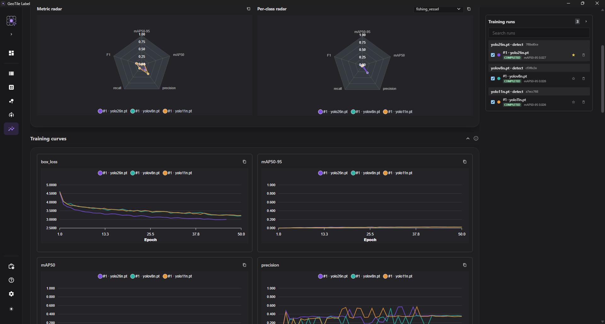
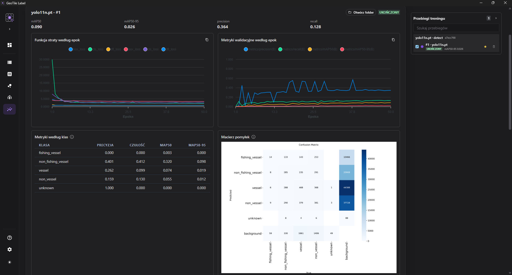

# Compare results

The **Results** tab serves one task: choosing the best training configuration **for one
particular dataset**.

## You choose the dataset first

Comparison always happens within one dataset version. Runs from different datasets cannot
be put side by side.

!!! info "The restriction is deliberate"

    Metrics computed on different test sets **are not comparable**. A model with a higher
    `mAP` on an easier set is not better - it merely had it easier. Putting such numbers in
    one table would suggest a conclusion that cannot be drawn from them.

Do you want to compare two datasets? Compare **configurations on each of them
separately**, and draw the conclusions from how the same configuration behaves.

## Grouping repetitions

Runs with an identical configuration are grouped together. That shows not only the result
but also **the spread between repetitions**.

!!! tip "The spread is sometimes larger than the difference between configurations"

    On small datasets two identical runs can differ more than two different
    configurations. Before deciding that one is better, check whether the difference goes
    beyond that spread. If it does not - repeat the run instead of choosing.

## The comparison panel

On the right there is a **collapsible run panel** (grouped by configuration, the best
`mAP50-95` at the top, with a search box). You tick the ones you want to put side by side
- each is given a fixed color used in every chart. The panel can be **collapsed** (the
chevron in its header) to give the full width to the charts; you expand it again with the
**Training runs** button.

- **The comparison table** - metrics in the rows, the selected runs in the columns. One
  run is starred as the **baseline (★)**; a **delta** relative to it then appears next to
  the others (green = higher). The **Diff only** switch hides the metrics that did not
  change.
- **The metric radar** - a quick comparison of the "shape" of several runs at once
  (`mAP50-95`, `mAP50`, precision, recall and `F1` on a 0–1 scale). `F1` is the harmonic
  mean of precision and recall - one number for the balance between them.
- **The per-class radar** - next to the overall one; the same set of axes, but for **one
  class chosen from a list** (there can be many classes, so you pick them from a dropdown
  rather than showing them all at once). It lets you compare runs on one specific, say
  weak, class.
- **The training curves** - an overlay of the curves (loss, `mAP`, precision, recall) by
  epoch for the selected runs.

Every chart has a **Copy PNG** icon (the clipboard) - for pasting into a report.

Clicking the name of a run sets the **focus** - its detail unfolds below: per-class
metrics, the confusion matrix and the test evaluation (all described below). The header of
the detail also has **Open folder** (the desktop version) - it opens the run directory
with the weights, `results.csv` and the manifests.

!!! info "Comparison works without a baseline too"

    The baseline serves only to compute the deltas. Without one you see the raw metrics
    side by side - a delta appears only once you designate a reference with the star.

!!! tip "A live preview during training"

    Select a **running** run and the **training curves** (loss, `mAP`, precision, recall)
    will grow live, refreshed about every 3 s, while the comparison table shows **the
    metrics from the last epoch** - before the training has even finished. You do not have
    to stay in the training tab.

*Three runs compared on one dataset.*

## Which metrics to read

**mAP50** is the more lenient one - an approximate hit on the object is enough.

**mAP50-95** averages over several matching thresholds and penalizes imprecise outlines.
It is more demanding and usually reflects practical usefulness better.

Use the **validation metrics** to compare configurations. Leave the test set for one final
evaluation.

## The one-time evaluation on the test set

The evaluation on the test set is performed **once per run** and stored as the final
result. Repeating it is blocked.

!!! danger "Looking at the test set repeatedly invalidates its purpose"

    A test set works only as long as it has had no influence on your decisions. When you
    choose a model by looking at its test results, the test becomes a second validation set
    - and the assessment stops saying anything about behavior on new data.

    The block is not an interface limitation. It is a guard against the most common
    methodological mistake at this point.

The order is therefore: iterate on the validation metrics, choose the model, and only then
check it once on the test set.

## Per-class metrics

An aggregate result can hide the fact that a model handles the dominant class well and
ignores the rare ones. The breakdown by class shows that outright.

A class with a markedly worse result usually means one of three things: too few examples,
inconsistent labeling, or confusion with a similar class.

## The confusion matrix

That last one - confusion between classes - is shown by two complementary views, below the
metrics, for a run with stored validation data.

**The confusion matrix** (interactive, in place of the static image from YOLO): rows =
prediction, columns = truth; the diagonal is the hits, and the last row/column is the
**background** - misses (FN) and false detections (FP). The switches:

- **Normalize** - the share within a column (for a given true class), as in the YOLO image
  (the default), or raw counts;
- **Log** - a logarithmic scale for a wide range of values;
- **Cluster order** - the clustering order (confusable classes sit next to each other) or
  the original one.

The original image from YOLO can be fetched with the **Download PNG** button.

Next to it is a **class similarity view** - a warmer tile marks a pair of classes the
model confuses more often; the cooler it is, the rarer.

*Confusable classes sit next to each other, so the hot pairs line up along the diagonal.*

The classes are not ordered alphabetically but **grouped** so that the pairs the model
confuses sit next to each other. With a large number of classes that makes the problem
visible as compact blocks along the diagonal, rather than as scattered individual tiles.
Below the matrix there is a list of the **most frequently confused pairs**.

Three switches govern readability:

- **Cluster order** - the grouped layout (the default) or the original class order;
- **Log** - a logarithmic scale, which brings out weak, rare confusions;
- **Diagonal** - the diagonal is a class's own hits; hiding it exposes the confusions
  alone.

!!! info "The matrix shows that a confusion exists - not why"

    Two classes may be confused because the objects really are similar, because some of the
    labels are wrong, or because what separates them is the sensor rather than the content.
    Only looking at examples settles it. The decision to merge classes or change the
    taxonomy is yours - the matrix is a hint about where to look, not a recommendation
    about what to do.

## Run performance diagnostics

The run directory contains `training_performance.json`. It is a technical report for
comparing speed and resource use, not a metric of model quality. Among other things it
contains:

- the epoch duration and the approximate number of images per second;
- the effective batch, the number of workers and the cache;
- the peak RSS of the process and of its process tree;
- the peak VRAM and the average GPU utilization, if the device exposes the measurement;
- `data_wait` with the semantics of `inter_batch_callback_gap_proxy` - an indicator of the
  gaps between batches, not a direct measurement of the DataLoader itself.

Compare telemetry only for runs on the same hardware, dataset and image size. Higher
images/s does not mean a better model; choosing a model is still what the validation
metrics and the test evaluation are for.

## Deleting a run

The bin icon next to a run in the rail **permanently** removes it from disk (the weights,
the logs, the manifest) - there is no recycle bin. An active run cannot be deleted; cancel
it first.

A **soft lineage gate** applies: if a model was registered from the run, the dialog
requires deliberate confirmation. After the deletion, the entries for those models
disappear, and if one of them was the project model, the project model pointer is cleared
(so prediction will not point at weights that no longer exist).

!!! tip "What this is for"

    The weights take up the most space - delete failed or weaker runs that you did not
    register as a model. The run behind a promoted model is usually kept.

## Next step

A model worth keeping should be [registered and promoted](rejestr-modeli.md).
